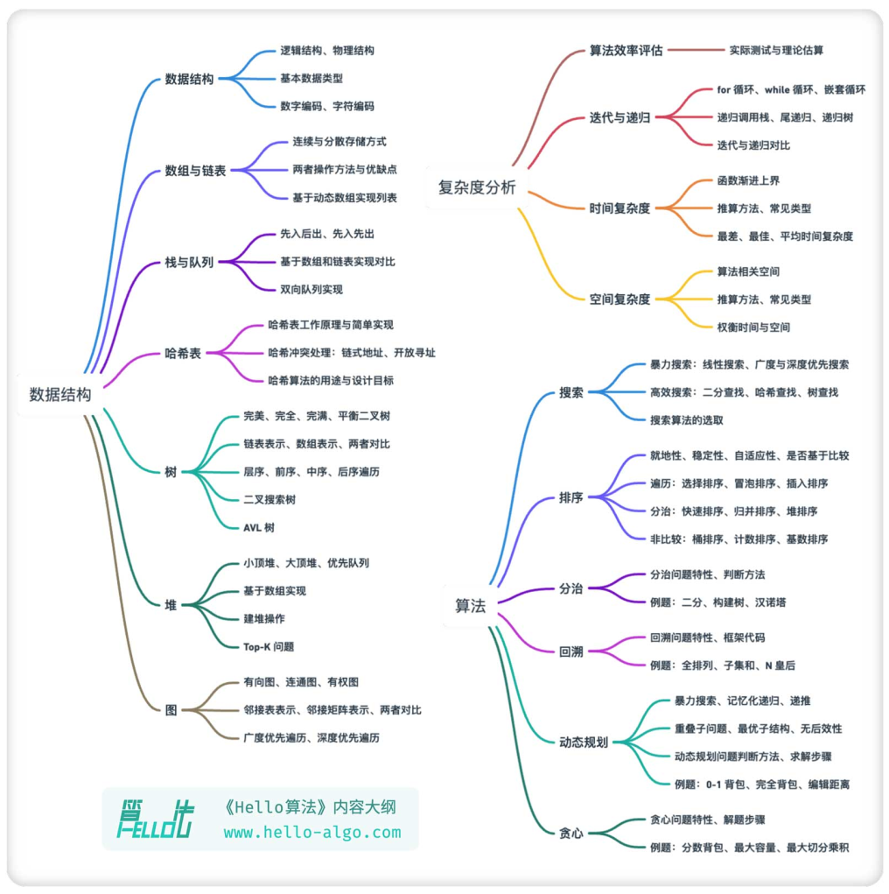
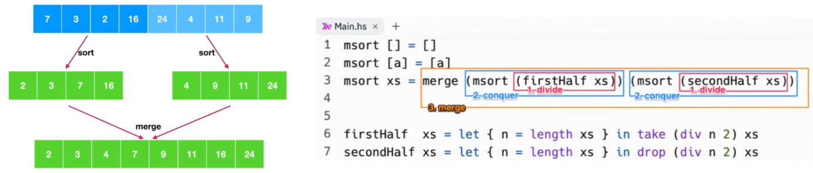
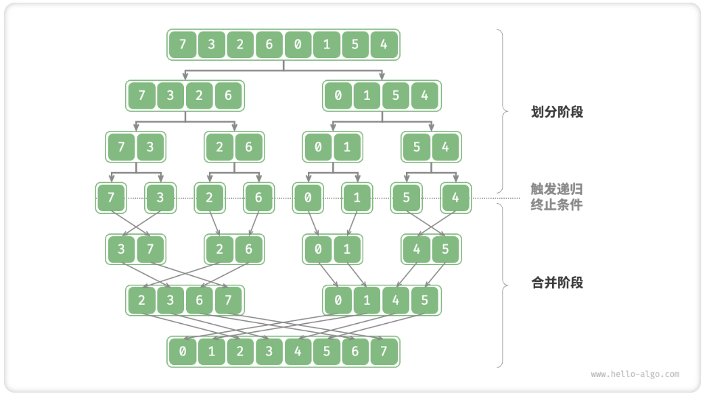
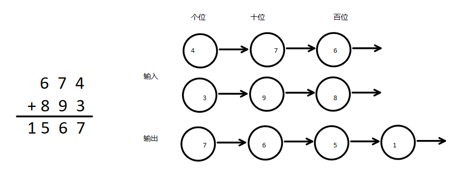

# algorithm-project

- 介绍

  这是我对算法课程学习的笔记记录。


- 参考

  [LeetCode](https://leetcode.cn/)

  [代码随想录 文档](https://programmercarl.com/)、hello algorithm、[左程云 代码仓库](https://github.com/algorithmzuo)


# Background

## BigPicture

- BigPicture

  

- algorithm是解决问题的步骤描述 —— problemSolving

  | 算法     | 描述                                                         | 例如                            |
  | -------- | ------------------------------------------------------------ | ------------------------------- |
  | 搜索     | 从数据结构中找到特定数据                                     | DFS、BFS、二分搜索              |
  | 排序     | 将一组数据按照特定顺序进行排列                               | 三傻、归并、快速、堆排序        |
  | 图算法   | 处理图形数据结构问题，如寻找最短路径、检查图的连通性         | Dijkstra、Floyd、最小生成树算法 |
  | 动态规划 | 将问题分解为相互依赖的子问题，并存储这些子问题的解以避免重复计算 | 斐波那契数列、旅行商问题        |
  | 分治算法 | 将问题分解为小问题，然后逐个解决小问题，合并小问题的解以获得原问题的解 | 快排、归并、大整数乘法          |
  | 贪心算法 | 在每一步选择中都采取当前状态下最优的选择，以期达到全局最优   | haffman编码、图的最小生成树     |
  | 回溯算法 | 通过试错搜索问题的可能解，发现不优解可退回一步               | 八皇后问题、数独问题、迷宫问题  |

- dataStructure

  | 类别 | 数据结构                           |
  | ---- | ---------------------------------- |
  | 基础 | 数组、链表、栈、队列               |
  | 高级 | 树（特别是二叉树）、图、堆、散列表 |
  | 抽象 | 集合、映射、字典                   |

  线性结构：数组List、链表；栈Stack、队列Queue

  树tree：二叉树(红黑树、AVL树)、非二叉树(B树、B+树)

  图graph：(顶点 边 权重) 深度优先算法、广度优先算法

  复合：哈希表hashTable、跳表、线段树、哈希链表

- 学习

  理论上学习其用途、实现方式、复杂度

  编程语言的现成API快速构造


- 算法的分类1 (这两个名词都不是计算机科学或算法中的标准术语)

  硬计算类算法：精确求解(某计算复杂度大)		 // acm

  软计算类算法：更注重逼近解决问题		  	// 模糊逻辑、神经网络、进化计算、概率理论、混沌理论、支持向量机、群体智能

  (应用场景：前端、后端、架构、算法)

- 算法的分类2

  知道怎么算的算法

  知道怎么试的算法：递归！！！

- 数据结构的分类1：是否连续的内存空间 (任何数据结构都一定是这两个结构拼出来的！没有例外！)

  连续结构：数组

  跳转结构：链表

  (具体说来：链表、队列、栈，可持久化线段树、树链剖分、后缀数组等等)

- 数据结构的分类2：是否简单的前后方向

  线性表：数组、链表、队列、栈 - 简单的前后方向

  非线性表：二叉树、堆、图 - 不是简单的前后方向


- 闲扯

  Niklaus Wirth：程序=数据机构+算法

  面试考算法，正如高考考数学——算法最锻炼coding

- 特点

  门槛最高，coding最难，无法突击

  摸清考察范围需要长时间积累

  需要大量练习

- 场景

  ACM和大厂面试有大部分的交叉内容，但是由于其场景的不同也存在不同

  ACM：需要解决很难的算法问题

  大厂面试：需要解决应用工程问题

- 为什么要考算法

  网站开发所涉及的范围已经到顶，目前的重点是优化算法性能

  企业需要降低成本：代码效率、用户响应、机器成本

  会算法的要么聪明要么努力

- 课程能解决什么

  有效练习：重点内容重点讲、非重点点到为止

  实战经验：大量练习积累其的敏感性

  联合实际：不独立地学知识点


## 算法的评价：时间空间复杂度

- 效率：如何充分利用计算机资源完成特定的任务

  优秀的算法：省内存、速度快
  
  


- 算法效率的三因素

  时间复杂度：流程决定

  空间复杂度：流程决定

  常数项时间：实现细节决定 —— 不理论分析 大样本实验run

- 常数时间操作O(1)

  一个操作的执行时间不以具体样本量为转移，每次执行时间都是固定时间

  有哪些：算术运算、位运算；赋值、比较、自增、自减；数组的寻址


- 时间复杂度

  不是明确的执行时间，而是一个函数。该函数描述了某算法随输入数据量的提升，执行时间随之上升的幅度

- 估计：

  将流程拆分成常数时间操作

  忽略细节(忽略低阶项忽略高阶项系数) —— 认为样本量n->inf

  按照最坏处理、按照平均处理


- 额外空间复杂度

  类似时间复杂度

- 估计：

  题目给的、题目要求的不算额外

  为了完成算法流程额外申请的空间

- 策略：空间换时间 (用户等待时间短、内存便宜、分布式运算)

  O(1)：额外使用有限几个变量
  
  O(N)：额外使用长度为n的数组
  
  O(MN)：额外使用M行N列的二维数组


## 验证算法的正确性：对数器

- 如何验证算法的正确性？在线测试、对数器

- 两套思路：算法B验、结果验证


- 对数器

  可以调试具体的数据量、验证算法的正确性

- 设计：

  随机样本产生器、可控制数据量大小、有具体例子代入

  两套思路的算法、A较好但待判、B暴力但必对


- 结果验

  ```java
      public static void main(String[] args) {
          // 指定数组的长度范围、值范围
          System.out.println("-----------测试开始-----------");
          int maxLen = 30;
          int maxValue = 1000;
          int testTimes = 100000;  // 大样本随机验证
  
          for (int i = 0; i < testTimes; i++) {
              int[] arr1 = lenRandomValueRandom(maxLen, maxValue);
              int[] tmp = copyArray(arr1);  // 在排序前先备份
              insertionSort(arr1);  // 核心
              if (!isSorted(arr1)) {
                  System.out.println("-----------排序出现错误-----------");
                  printArray(tmp);  // 打印错误的具体例子
                  break;  // 只要有一个错误就终止
              }
          }
  
          System.out.println("-----------程序执行完毕-----------");
      }
      
      // 随机生成一个数组arr，数组长度[0,maxLen-1]，数组中的元素值[0,maxValue-1]
      public static int[] lenRandomValueRandom(int maxLen, int maxValue) {
          int len = (int) (Math.random() * maxLen);
          int[] ans = new int[len];
  
          for (int i = 0; i < len; i++) {
              ans[i] = (int) (Math.random() * maxValue);
          }
          return ans;
      }
      
      // 结果验：判断是否升序
      public static boolean isSorted(int[] arr) {
          if (arr.length < 2) {
              return true;  // 不到两个数 默认升序
          }
  
          int maxValue = arr[0];  // 不妨设0位置为最大值
          for (int i = 0; i < arr.length; i++) {
              if (maxValue > arr[i]) {  // 后面出现的数居然更小 不是升序
                  return false;
              }
              maxValue = Math.max(maxValue, arr[i]);  // 更新最大值
          }
          return true;
      }
  ```

- 算法B验

  ```
      public static void main(String[] args) {
          // 指定数组的长度范围、值范围
          System.out.println("-----------测试开始-----------");
          int maxLen = 30;
          int maxValue = 1000;
          int testTimes = 100000;  // 大样本随机验证
  
          boolean succeed = true;
          for (int i = 0; i < testTimes; i++) {
              int[] arr1 = lenRandomValueRandom(maxLen, maxValue);
              int[] tmp = copyArray(arr1);  // 在排序前先备份
              insertionSort(arr1);  // 核心
              comparator(tmp);  // 暴力
  
              if (!isEqual(arr1, tmp)) {
                  System.out.println("-----------排序出现错误-----------");
                  succeed = false;
                  printArray(arr1);
                  printArray(tmp);
                  break;  // 只要有一个错误就终止
              }
          }
          System.out.println(succeed ? "nice!" : "fucking fucked");
  
          System.out.println("-----------程序执行完毕-----------");
  
      }
      
      // 算法B验：系统提供的
      public static void comparator(int[] arr) {
          Arrays.sort(arr);
      }
  
      // 算法B验：判断两个结果是否相同
      public static boolean isEqual(int[] arr1, int[] arr2) {
          if ((arr1 == null && arr2 != null) || (arr1 != null && arr2 == null)) {
              return false;
          }
          if (arr1 == null && arr2 == null) {
              return true;
          }
          if (arr1.length != arr2.length) {
              return false;
          }
          for (int i = 0; i < arr1.length; i++) {
              if (arr1[i] != arr2[i]) {
                  return false;
              }
          }
          return true;
      }
  ```

  


## 语言特有


# Recursion

- 递归的特性：调用自身、结束条件

  ```python
  # 不是递归 没有结束条件 —— 无限调用
  def f1(x):
      print(x)
      f1(x - 1)
  
  
  # 不是递归，到不了结束条件 —— 无限调用
  def f2(x):
      if x > 0:
          print(x)
          f2(x + 1)
  
  
  # 是递归 9,8,7,……
  def f3(x):
      if x > 0:
          print(x)
          f3(x - 1)
  
  
  # 是递归 1,2,3,……
  def f4(x):
      if x > 0:
          f4((x - 1))
          print(x)
  ```

- 【趣味】汉诺塔问题

  >假设有三根钉子，分别为 A（源钉子），B（辅助钉子）和 C（目标钉子），以及 n 个盘子。
  >
  >每次只能移动一个盘子。每次移动后，较大的盘子不能放在较小的盘子上面、

  递归解：

  将前 n-1 个盘子从 A 移动到 B，使用 C 作为辅助钉子。

  然后将最大的盘子（第 n 个盘子）从 A 移动到 C。

  最后将那 n-1 个盘子从 B 移动到 C，使用 A 作为辅助钉子。

  ```python
  # -*- coding: utf-8 -*-
  # @Author  : yingzhu
  # @Time    : 2023/12/9 10:58
  # @File    ：HanoiV1.py
  # @Function: 趣味递归 汉诺塔问题
  
  def hanoi(n, source, auxiliary, target):
      """
      n个盘子，从a经过b来到c
      :param n: n个盘子
      :param source: 柱子a，源
      :param auxiliary: 柱子b，辅助
      :param target: 柱子c，目标
      :return:
      """
      # 递归终止条件：n=0
      if n > 0:
          # n-1个盘子，从a经过c来到b —— 递归(相同模式、输入规模更小的)
          hanoi(n - 1, source, target, auxiliary)
          # 把第n个盘子，从a移动到c —— 移动一个
          print(f'moving from {source} to {target}')
          # n-1个盘子，从b经过a来到c —— 递归(相同模式、输入规模更小的)
          hanoi(n - 1, auxiliary, source, target)
  
  
  if __name__ == '__main__':
      hanoi(3, 'a', 'b', 'c')
  ```

  返回所走步骤数

  ```python
  # -*- coding: utf-8 -*-
  # @Author  : yingzhu
  # @Time    : 2023/12/9 10:25
  # @File    ：HanoiV2.py
  # @Function: 返回所走步骤数
  
  def hanoi(n, source, auxiliary, target):
      """
      n个盘子，从a经过b来到c
      :param n: n个盘子
      :param source: 柱子a，源
      :param auxiliary: 柱子b，辅助
      :param target: 柱子c，目标
      :return: 所需的步骤数step
      """
  
      if n == 0:
          return 0
  
      # 递归终止条件：n=0
      if n > 0:
          # n-1个盘子，从a经过c来到b —— 递归(相同模式、输入规模更小的)
          step = hanoi(n - 1, source, target, auxiliary)
          # 把第n个盘子，从a移动到c —— 移动一个
          print(f'moving from {source} to {target}')
          step += 1
          # n-1个盘子，从b经过a来到c —— 递归(相同模式、输入规模更小的)
          step += hanoi(n - 1, auxiliary, source, target)
  
      return step
  
  
  if __name__ == '__main__':
      print(hanoi(64, 'a', 'b', 'c'))
  ```

  进度条

  ```python
  # -*- coding: utf-8 -*-
  # @Author  : yingzhu
  # @Time    : 2023/12/9 10:58
  # @File    ：HanoiV3.py
  # @Function: 进度条
  
  def hanoi(n, source, auxiliary, target, current_step, total_steps):
      if n == 0:
          return current_step
  
      if n > 0:
          current_step = hanoi(n - 1, source, target, auxiliary, current_step, total_steps)
          current_step += 1
          print_progress_bar(current_step, total_steps)
          print(f'moving from {source} to {target}')
          current_step = hanoi(n - 1, auxiliary, source, target, current_step, total_steps)
  
      return current_step
  
  
  def print_progress_bar(current_step, total_steps):
      percent = (current_step / total_steps) * 100
      bar = '=' * int(percent / 2) + ' ' * (50 - int(percent / 2))
      print(f"\rProgress: [{bar}] {percent:.2f}%  ", end='')
  
  
  if __name__ == '__main__':
      num = 20
      total_steps = 2 ** num - 1
      hanoi(num, 'a', 'b', 'c', 0, total_steps)
      print(f'total_steps: {total_steps}')
  ```

- 九连环问题


# Sorting Algorithm

- 排序算法

  三傻：冒泡排序、插入排序、选择排序

  分治：归并排序、快速排序、堆排序

  线性：桶排序、计数排序、基数排序

- 感性理解为什么三傻排序时间复杂度这么高？

  三傻排序大量浪费比较行为，每次比较行为都独立，没有借助以前的比较结果

  归并排序浪费得少，每次merge都留下了有序部分

- 应用：网站开发的本质是增删改查

- 比较

  | 排序算法 | 时间复杂度 | 额外空间复杂度 | 稳定性 | 就地性 | 自适应性 | 是否基于比较 |
  | -------- | ---------- | -------------- | ------ | ------ | -------- | ------------ |
  | 冒泡排序 | O(N^2)     | O(1)           | 是     | 是     | 否       | 是           |
  | 选择排序 | O(N^2)     | O(1)           | 否     | 是     | 否       | 是           |
  | 插入排序 | O(N^2)     | O(1)           | 是     | 是     | 是       | 是           |
  | 希尔排序 | O(NlogN)   | O(1)           | 否     | 是     | 否       | 是           |
  | 归并排序 | O(NlogN)   | O(N)           | 是     | 否     | 否       | 是           |
  | 快速排序 | O(NlogN)   | O(logN)        | 否     | 是     | 否       | 是           |
  | 堆排序   | O(NlogN)   | O(1)           | 否     | 是     | 否       | 是           |
  | 桶排序   | O(N+k)     | O(N+k)         | 是     | 否     | 否       | 否           |
  | 基数排序 | O(N*k)     | O(N+k)         | 是     | 否     | 否       | 否           |
  | 计数排序 | O(N+k)     | O(k)           | 是     | 否     | 否       | 否           |


## 工具类和对数器

- 对数器

  ```java
  package SortingAlgorithm;
  
  public class ArrayTool {
      // 数据：随机生成数组
      public static int[] lenRandomValueRandom(int maxLex, int maxValue) {
          int[] ans = new int[(int) (Math.random() * maxLex + 1)];
          for (int i = 0; i < ans.length; i++) {
              ans[i] = (int) (Math.random() * (maxValue + 1)) - (int) (Math.random() * maxValue);
          }
          return ans;
      }
  
      // 对数器/校验方法一：判断有序与否
      public static boolean isSorted(int[] arr) {
          // 边界处理：不到两个数默认升序
          if (arr == null || arr.length < 2)
              return true;
  
          int maxValue = arr[0];  // 不妨设0位置为最大值
          for (int i = 0; i < arr.length; i++) {
              if (maxValue > arr[i])
                  return false;  // 若0位置真是最大值 即后面出现数居然更小 不是升序
              maxValue = Math.max(maxValue, arr[i]);  // 更新最大值
          }
          return true;
      }
  
      // 对数器/检验方法二：暴力方法对比
      public static boolean isEqual(int[] arr1, int[] arr2) {
          if ((arr1 == null && arr2 != null) || (arr1 != null && arr2 == null))
              return false;
          if (arr1 == null && arr2 == null)
              return true;
          if (arr1.length != arr2.length)
              return false;
  
          for (int i = 0; i < arr1.length; i++) {
              if (arr1[i] != arr2[i])
                  return false;
          }
          return true;
      }
  
  ```

- 工具类

  ```java
      
  	// 打印数组
      public static void printArray(int[] arr) {
          if (arr == null)
              return;
  
          for (int i = 0; i < arr.length; i++) {
              System.out.print(i != arr.length - 1 ? arr[i] + ", " : arr[i]);
          }
          System.out.println();
      }
  
      // 交换行为
      public static void swap(int[] arr, int i, int j) {
          arr[i] = arr[i] ^ arr[j];  // a=a^b
          arr[j] = arr[i] ^ arr[j];  // b=a^b  b=a^b^b  b=a
          arr[i] = arr[i] ^ arr[j];  // a=a^b  a=a^a^b  a=b
      }
  
      // 拷贝数组内容
      public static int[] copyArray(int[] arr) {
          if (arr == null)
              return null;
  
          int[] ans = new int[arr.length];
          for (int i = 0; i < arr.length; i++) {
              ans[i] = arr[i];
          }
          return ans;
      }
  }
  ```

  


## 三傻排序

- Bubble Sort

  外循环：未排序区间为 [0, i]

  内循环：将未排序区间 [0, i] 中的最大元素交换至该区间的最右端

- 流程：

  [0,n-1]两两比较谁大谁往后 —— arr[n-1]完成排序

  [1,n-1]两两比较谁大谁往后 —— arr[n-2]完成排序

  [2,n-1]两两比较谁大谁往后 —— arr[n-3]完成排序

- 时间复杂度：O(n^2)

- 代码实现

  ```java
      // 冒泡排序(两两比较后交换)
      public static void bubbleSort(int[] arr) {
          // 边界条件：空、非空但数目少于2
          if (arr == null || arr.length < 2) {
              return;  // 不需要排序
          }
  
          int n = arr.length;
          // 外循环：未排序区间为 [0, i]
          for (int end = n - 1; end > 0; end--) {
              // 内循环：将未排序区间 [0, i] 中的最大元素交换至该区间的最右端
              for (int second = 1; second <= end; second++) {
                  if (arr[second - 1] > arr[second]) {  // 比较相邻的两个元素，如果顺序错误就交换它们
                      swap(arr, second, second - 1);
                  }
              }
          }
      }
  
      // 冒泡排序(两两比较后交换)：一整轮没有交换则提前结束 —— 效率优化
      public static void bubbleSort2(int[] arr) {
          // 边界条件：空、非空但数目少于2
          if (arr == null || arr.length < 2) {
              return;  // 不需要排序
          }
  
          int n = arr.length;
          boolean flag = false;  // 标志位 检测某轮排序没有交换行为即退出
          // 外循环：未排序区间为 [0, i]
          for (int end = n - 1; end > 0; end--) {
              // 内循环：将未排序区间 [0, i] 中的最大元素交换至该区间的最右端
              for (int second = 1; second <= end; second++) {
                  if (arr[second - 1] > arr[second]) {  // 比较相邻的两个元素，如果顺序错误就交换它们
                      swap(arr, second, second - 1);
                  }
              }
              if (!flag)
                  break;  // 标志位 检测某轮排序没有交换行为即退出
          }
      }
  ```

  


- Selection Sort

  外循环：未排序区间为 [i, n-1]

  内循环：找到未排序区间内的最小元素

- 流程：

  [0,n-1]找到最小值，最小值去0位置 —— arr[0]完成排序

  [1,n-1]找到最小值，最小值去1位置 —— arr[1]完成排序

  [2,n-1]找到最小值，最小值去2位置 —— arr[2]完成排序

- 时间复杂度：

  [0,n-1]每个位置：看+比；后一次交换 —— n*(1+1)+1

  [1,n-1]每个位置：看+比；后一次交换 —— (n-1)*(1+1)+1

  [2,n-1]每个位置：看+比；后一次交换 —— (n-2)*(1+1)+1

  —— 2*((n+1)n/2)+n = n^2+2n

  —— O(n^2)
  
- 代码实现

  ```java
      // 选择排序
      public static void selectionSort(int[] arr) {
          // 边界条件：空、非空但数目少于2
          if (arr == null || arr.length < 2) {
              return;  // 不需要排序
          }
  
          int n = arr.length;
          // 外循环：未排序区间为 [i, n-1]
          for (int i = 0; i < n; i++) {
              int minValueIndex = i;  // 找到最小值对应的索引 不妨设
              // 内循环：找到未排序区间内的最小元素
              for (int j = i + 1; j < n; j++) {
                  minValueIndex = arr[j] < arr[minValueIndex] ? j : minValueIndex;
              }
              swap(arr, i, minValueIndex);
          }
      }
  ```

  


- Insertion Sort (小数据可用)

  外循环：已排序元素数量为 1, 2, ..., n

  内循环：将 base 插入到已排序部分的正确位置

- 流程：

  [0,0]有序，关注新来的arr[0]，左边数大则交换直到左边无数 —— arr[0]完成排序

  [0,1]有序，关注新来的arr[1]，左边数大则交换直到左边无数 —— arr[1]完成排序

  [0,2]有序，关注新来的arr[2]，左边数大则交换直到左边无数 —— arr[2]完成排序

- 时间复杂度：O(n^2)

- 代码实现

  ```java
      // 直接插入排序
      public static void insertionSort(int[] arr) {
          // 边界条件：空、非空但数目少于2
          if (arr == null || arr.length < 2) {
              return;  // 不需要排序
          }
  
          int n = arr.length;
          // 外循环：已排序元素数量为 1, 2, ..., n
          for (int end = 1; end < n; end++) {  // end当前关注的数  pre当前关注的数的左一个
              // 内循环：将 base 插入到已排序部分的正确位置
              for (int pre = end - 1; pre >= 0 && arr[pre] > arr[pre + 1]; pre--) {
                  swap(arr, pre, pre + 1);
              }
              /*for (int pre = end - 1; pre >= 0; pre--) {
                  if (arr[pre] > arr[pre + 1]) {
                      swap(arr, pre, pre + 1);
                      end = pre;
                  }
              }*/
          }
      }
  
      // 直接插入排序
      public static void insertionSort2(int[] arr) {
          // 边界条件：空、非空但数目少于2
          if (arr == null || arr.length < 2) {
              return;  // 不需要排序
          }
  
          int n = arr.length;
          // 外循环：已排序元素数量为 1, 2, ..., n
          for (int end = 1; end < n; end++) {  // end当前关注的数  pre当前关注的数的左一个
              int base = arr[end], pre = end - 1;
              // 内循环：将 base 插入到已排序部分的正确位置
              while (pre >= 0 && arr[pre] > base) {
                  arr[pre + 1] = arr[pre];  // 将arr[pre]向右移动一位
                  pre--;
              }
              arr[pre + 1] = base;  // 将base赋值到正确位置
          }
      }
  ```

  


- 改进：Shell Sort 

  概念：增量


## 分治排序 Merge Sort

- 总结

  什么样的题目用merge？

  在纠结每个数，右边有多少数比你小


- Merge Sort

  左有序[L,M]、右有序[M+1,R]、整体有序

  

- 流程：

  划分阶段：通过递归不断地将数组从中点处分开，将长数组的排序问题转换为短数组的排序问题。

  合并阶段：当子数组长度为 1 时终止划分，开始合并，持续地将左右两个较短的有序数组合并为一个较长的有序数组，直至结束。

  

- 复杂度估计：

  master公式：$T(N)=2*T(\frac{N}{2})+O(N)$ -> O(NlogN)

  迭代过程：logN次的O(N) -> O(NlogN)

  额外空间复杂度：O(N)

- 联系：和二叉树后序遍历

  **后序遍历**：先递归左子树，再递归右子树，最后处理根节点。

  **归并排序**：先递归左子数组，再递归右子数组，最后处理合并。


- 代码实现

  关键的merge

  ```java
      private static void merge(int[] arr, int left, int mid, int right) {
          // 创建临时数组tmp 用于存放合并后的结果  【额外空间复杂度】
          int[] tmp = new int[right - left + 1];
          // 初始化左子数组和右子数组的起始索引
          int i = left, j = mid + 1, k = 0;  // 指针ij记录左右越界  k为tmp数组
  
          // 当左右子数组都还有元素时：比较并将较小的元素复制到临时数组中
          while (i <= mid && j <= right)
              tmp[k++] = arr[i] <= arr[j] ? arr[i++] : arr[j++];  // 谁小拷贝谁
          // 当一个子数组没有元素：将另一个子数组剩余元素复制到临时数组中
          while (i <= mid)   // 左子数组剩余
              tmp[k++] = arr[i++];
          while (j <= right)   // 有子数组剩余
              tmp[k++] = arr[j++];
  
          // 将临时数组tmp中的元素复制回数组arr的对应区间
          for (int l = 0; l < tmp.length; l++) {
              arr[left + l] = tmp[l];
          }
      }
  ```

- 递归实现

  步骤：

  [4,3,1,5]

  左边有序：3,4  // 指针 黑盒  递归 

  右边有序：1,5  // 指针 黑盒  递归 

  再整体：1,3,4,5 // merge

  ```java
      // 递归实现归并排序
      public static void mergeSort1(int[] arr) {
          // 边界处理：不到两个数默认升序
          if (arr == null || arr.length < 2)
              return;
  
          processMergeSort(arr, 0, arr.length - 1);
      }
  
      public static void processMergeSort(int[] arr, int left, int right) {
          // 终止条件：当子数组长度为1时终止递归  (一个数天然有序)
          if (left >= right)   // left == right
              return;
          // 划分阶段  (不止一个数)
          int mid = left + ((right - left) >> 1);
          processMergeSort(arr, left, mid);  // 左边有序 递归左子数组
          processMergeSort(arr, mid + 1, right);  // 右边有序 递归右子数组
          // 合并阶段
          merge(arr, left, mid, right);  // 左右有序
      }
  ```

- 非递归实现

  步骤：核心概念是步长

  [3,1,0,2,6,7,1,2,0]

  步长为一：1,3		0,2		6,7		1,2		0

  步长为二：0,1,2,3				1,2,6,7				0

  步长为四：0,1,1,2,2,3,6,7								0

  步长为八：0,0,1,1,2,2,3,6,7

  步长为十六：步长超过arr.len则停止

  ```java
      // 迭代实现归并排序
      public static void mergeSort2(int[] arr) {
          // 边界处理：不到两个数默认升序
          if (arr == null || arr.length < 2)
              return;
  
          int N = arr.length;
          int step = 1;  // 步长：1,2,4,8
          while (step < N) {
              int left = 0;  // 当前左组的第一个位置
              while (left < N) {
                  if (step >= N - left)
                      break;
                  int mid = left + step - 1;
                  int right = mid + Math.min(step, N - mid - 1);
                  merge(arr, left, mid, right);  // 关键merge
                  left = right + 1;  // 迭代
              }
              if (step > N / 2)  // 防止溢出
                  break;
              step <<= 1;  // 步长乘2
          }
      }
  ```


- 代码汇总

  ```java
  package SortingAlgorithm;
  
  import java.util.Arrays;
  
  import static SortingAlgorithm.ArrayTool.*;
  
  public class MergeSort {
      // 递归实现归并排序
      public static void mergeSort1(int[] arr) {
          // 边界处理：不到两个数默认升序
          if (arr == null || arr.length < 2)
              return;
  
          processMergeSort(arr, 0, arr.length - 1);
      }
  
      public static void processMergeSort(int[] arr, int left, int right) {
          // 终止条件：当子数组长度为1时终止递归  (一个数天然有序)
          if (left >= right)   // left == right
              return;
          // 划分阶段  (不止一个数)
          int mid = left + ((right - left) >> 1);
          processMergeSort(arr, left, mid);  // 左边有序 递归左子数组
          processMergeSort(arr, mid + 1, right);  // 右边有序 递归右子数组
          // 合并阶段
          merge(arr, left, mid, right);  // 左右有序
      }
  
      // 迭代实现归并排序
      public static void mergeSort2(int[] arr) {
          // 边界处理：不到两个数默认升序
          if (arr == null || arr.length < 2)
              return;
  
          int N = arr.length;
          int step = 1;  // 步长：1,2,4,8
          while (step < N) {
              int left = 0;  // 当前左组的第一个位置
              while (left < N) {
                  if (step >= N - left)
                      break;
                  int mid = left + step - 1;
                  int right = mid + Math.min(step, N - mid - 1);
                  merge(arr, left, mid, right);  // 关键merge
                  left = right + 1;  // 迭代
              }
              if (step > N / 2)  // 防止溢出
                  break;
              step <<= 1;  // 步长乘2
          }
      }
  
      private static void merge(int[] arr, int left, int mid, int right) {
          // 创建临时数组tmp 用于存放合并后的结果  【额外空间复杂度】
          int[] tmp = new int[right - left + 1];
          // 初始化左子数组和右子数组的起始索引
          int i = left, j = mid + 1, k = 0;  // 指针ij记录左右越界  k为tmp数组
  
          // 当左右子数组都还有元素时：比较并将较小的元素复制到临时数组中
          while (i <= mid && j <= right)
              tmp[k++] = arr[i] <= arr[j] ? arr[i++] : arr[j++];  // 谁小拷贝谁
          // 当一个子数组没有元素：将另一个子数组剩余元素复制到临时数组中
          while (i <= mid)   // 左子数组剩余
              tmp[k++] = arr[i++];
          while (j <= right)   // 有子数组剩余
              tmp[k++] = arr[j++];
  
          // 将临时数组tmp中的元素复制回数组arr的对应区间
          for (int l = 0; l < tmp.length; l++) {
              arr[left + l] = tmp[l];
          }
      }
  
      public static void main(String[] args) {
          System.out.println("-------------测试开始-------------");
          int maxLen = 300;
          int maxValue = 1000;
          int testTime = 100000;  // 大样本随机验证
          boolean succeed = true;
  
          for (int i = 0; i < testTime; i++) {
              int[] arr1 = lenRandomValueRandom(maxLen, maxValue);
              int[] arr2 = copyArray(arr1);
  
              /*mergeSort2(arr1);*/
              mergeSort1(arr1);  // 核心
              violence(arr2);  // 暴力
  
              if (!isEqual(arr1, arr2)) {
                  System.out.println("-------------打印错误-------------");
                  succeed = false;
                  printArray(arr1);
                  printArray(arr2);
                  break;  // 只要有一个错误就停止
              }
          }
          System.out.println(succeed ? "正确！" : "错误！");
          System.out.println("-------------执行完毕-------------");
      }
  
      // 暴力
      public static void violence(int[] arr) {
          Arrays.sort(arr);
      }
  }
  ```


- 【题目】最小和问题

  > 给一个数组，将每个数左边比该数小的数加起来，作为该数的最小和，最后将所有数的最小和相加作为最后的最小和。
  >
  > 例如：3，10，6，17，9
  >
  > 3左边没有，最小和为0
  >
  > 10左边3比10小，最小和为3
  >
  > 6左边3比6小，最小和为3
  >
  > 17左边3，10，6都比17小，最小和为3+10+6=19
  >
  > 9左边3，6比9小，最小和为3+6=9
  >
  > 所以最终的最小和为0+3+3+19+9=34

  暴力解：for for

  更优解：merge —— 转化求右边大的个数、利用merge有序炸出个数

  ```java
  package SortingAlgorithm;
  
  import static SortingAlgorithm.ArrayTool.*;
  
  public class MergeSort2SmallSum {
      public static int smallSum(int[] arr) {
          // 边界处理
          if (arr == null || arr.length < 2)
              return 0;
  
          return process(arr, 0, arr.length - 1);
      }
  
      public static int process(int[] arr, int left, int right) {
          // 终止条件
          if (left >= right)
              return 0;
          // left < right
          int mid = left + ((right - left) >> 1);
          return process(arr, left, mid) + process(arr, mid + 1, right) + merge(arr, left, mid, right);
      }
  
      private static int merge(int[] arr, int left, int mid, int right) {
          int[] tmp = new int[right - left + 1];
          int i = left, j = mid + 1, k = 0, res = 0;
  
          while (i <= mid && j <= right) {
              res += arr[i] < arr[j] ? (right - j + 1) * arr[i] : 0;
              tmp[k++] = arr[i] < arr[j] ? arr[i++] : arr[j++];
          }
          while (i <= mid)
              tmp[k++] = arr[i++];
          while (j <= right)
              tmp[k++] = arr[j++];
  
          for (int l = 0; l < tmp.length; l++) {
              arr[left + l] = tmp[l];
          }
          return res;
      }
  
      public static void main(String[] args) {
          System.out.println("-------------测试开始-------------");
          int maxLen = 300;
          int maxValue = 100;
          int testTime = 100000;
          boolean succeed = true;
  
          for (int i = 0; i < testTime; i++) {
              int[] arr1 = lenRandomValueRandom(maxLen, maxValue);
              int[] arr2 = copyArray(arr1);
  
              if (smallSum(arr1) != violence(arr2)) {
                  System.out.println("-------------打印错误-------------");
                  succeed = false;
                  printArray(arr1);
                  printArray(arr2);
                  break;
              }
          }
          System.out.println(succeed ? "正确！" : "错误！");
          System.out.println("-------------执行完毕-------------");
      }
  
      // 校验：暴力
      public static int violence(int[] arr) {
          // 边界处理
          if (arr == null || arr.length < 2)
              return 0;
  
          int res = 0;
          for (int i = 1; i < arr.length; i++) {
              for (int j = 0; j < i; j++) {
                  res += arr[j] < arr[i] ? arr[j] : 0;
              }
          }
          return res;
      }
  }
  ```

  


- 【题目】[求数组逆序对](https://leetcode.cn/problems/shu-zu-zhong-de-ni-xu-dui-lcof/description/)

  > 在股票交易中，如果前一天的股价高于后一天的股价，则可以认为存在一个「交易逆序对」。请设计一个程序，输入一段时间内的股票交易记录 `record`，返回其中存在的「交易逆序对」总数。
  >
  > 示例 1:
  >
  > 输入：record = [9, 7, 5, 4, 6]
  >
  > 输出：8
  >
  > 解释：交易中的逆序对为 (9, 7), (9, 5), (9, 4), (9, 6), (7, 5), (7, 4), (7, 6), (5, 4)。

  暴力解：for for

  更优解：转化求左边大的个数

  ```java
  package SortingAlgorithm;
  
  import static SortingAlgorithm.ArrayTool.*;
  
  public class MergeSort3ReversePairs {
      public static int reversePairs(int[] arr) {
          // 边界处理
          if (arr == null || arr.length < 2)
              return 0;
  
          return process(arr, 0, arr.length - 1);
      }
  
      private static int process(int[] arr, int left, int right) {
          // 终止条件
          if (left >= right)
              return 0;
          // left < right
          int mid = left + ((right - left) >> 1);
          return process(arr, left, mid) + process(arr, mid + 1, right) + merge(arr, left, mid, right);
      }
  
      private static int merge(int[] arr, int left, int mid, int right) {
          int[] tmp = new int[right - left + 1];
          int i = left, j = mid + 1, k = 0, res = 0;
  
          while (i <= mid && j <= right) {
              res += arr[i] > arr[j] ? (mid - i + 1) : 0;
              tmp[k++] = arr[i] > arr[j] ? arr[j++] : arr[i++];
          }
          while (i <= mid)
              tmp[k++] = arr[i++];
          while (j <= right)
              tmp[k++] = arr[j++];
  
          for (int l = 0; l < tmp.length; l++) {
              arr[left + l] = tmp[l];
          }
          return res;
      }
  
      private static int merge2(int[] arr, int left, int mid, int right) {
          int[] tmp = new int[right - left + 1];
          int i = mid, j = right, k = tmp.length - 1, res = 0;
  
          while (i >= left && j >= mid + 1) {
              res += arr[i] > arr[j] ? (j - mid) : 0;
              tmp[k--] = arr[i] > arr[j] ? arr[i--] : arr[j--];
          }
          while (i >= left)
              tmp[k--] = arr[i--];
          while (j >= mid + 1)
              tmp[k--] = arr[j--];
  
          for (int l = 0; l < tmp.length; l++) {
              arr[left + l] = tmp[l];
          }
          return res;
      }
  
      public static void main(String[] args) {
          System.out.println("-------------测试开始-------------");
          int maxLen = 300;
          int maxValue = 100;
          int testTime = 100000;
          boolean succeed = true;
  
          for (int i = 0; i < testTime; i++) {
              int[] arr1 = lenRandomValueRandom(maxLen, maxValue);
              int[] arr2 = copyArray(arr1);
  
              if (reversePairs(arr1) != violence(arr2)) {
                  System.out.println("-------------打印错误-------------");
                  succeed = false;
                  printArray(arr1);
                  printArray(arr2);
                  break;
              }
          }
          System.out.println(succeed ? "正确！" : "错误！");
          System.out.println("-------------执行完毕-------------");
      }
  
      // 校验：暴力
      public static int violence(int[] arr) {
          // 边界处理
          if (arr == null || arr.length < 2)
              return 0;
  
          int res = 0;
          for (int i = 0; i < arr.length; i++) {  // 遍历数组中所有的数字arr[i]
              for (int j = i; j < arr.length; j++) {  // 当前数的右边数字arr[j]
                  res += arr[i] > arr[j] ? 1 : 0;
              }
          }
          return res;
      }
  }
  ```

  


- 【题目】[翻转对](https://leetcode.com/problems/reverse-pairs/)

  > 给定一个数组 `nums` ，如果 `i < j` 且 `nums[i] > 2*nums[j]` 我们就将 `(i, j)` 称作一个**重要翻转对**。
  >
  > 你需要返回给定数组中的重要翻转对的数量。
  >
  > 示例 1: 输入: [1,3,2,3,1]; 输出: 2
  >
  > 示例 2: 输入: [2,4,3,5,1]; 输出: 3
  >

  


- 【题目】[Count Of Range Sum](https://leetcode.com/problems/count-of-range-sum/)

  


## 分治排序 Quick Sort

- partition过程

  


- 【题目】[荷兰国旗问题](https://leetcode.cn/problems/sort-colors/description/)

  > 现有红白蓝三个不同颜色的小球，乱序排列在一起，请重新排列这些小球，使得红白蓝三色的同颜色的球在一起。
  >
  > 这个问题之所以叫荷兰国旗问题，是因为我们可以将红白蓝三色小球想象成条状物，有序排列后正好组成荷兰国旗。

  


- 快速排序

  (以序列的第一个数为哨兵 或 最后一个数为哨兵)

  Partition：小于等于num的数放左边，大于num的数放右边，不保证左右子数组内部有序 —— 时间复杂度O(N) 额外空间复杂度O(1)

  递归过程

- 流程

  初始化基准数和指针i、j

  一个循环：每轮i找第一个比基准数大的、j找第一个比基准数小的，两元素交换

  两指针相遇结束循环

  (哨兵划分：左子数组、基准数、右子数组)

- 代码实现

  ```java
  package d001;
  
  public class D001Sort2QuickSort {
      // arr[i]和arr[j]交换
      public static void swap(int[] arr, int i, int j) {
          int tmp = arr[i];
          arr[i] = arr[j];
          arr[j] = tmp;
      }
  
      // 快速排序的主函数
      public static void quickSort(int[] arr, int left, int right) {
          // 子数组长度为1 则停止递归
          if (left >= right)
              return;
          // 哨兵划分
          int pivot = partition(arr, left, right);
          // 递归左子数组 右子数组
          quickSort(arr, left, pivot - 1);
          quickSort(arr, pivot + 1, right);
      }
  
      // 哨兵划分：将一个较长数组的排序问题简化为两个较短数组的排序问题 (对数组进行分区的函数)
      private static int partition(int[] arr, int left, int right) {
          int i = left, j = right;  // 以arr[left]为基准数
          while (i < j) {
              while (i < j && arr[j] >= arr[left])
                  j--;  // 从右到左找首个小于基准数的元素
              while (i < j && arr[i] <= arr[left])
                  i++;  // 从左到右找首个大于基准数的元素
              swap(arr, i, j);
          }
          swap(arr, i, left);  // 将基准数交换至两个子数组的分界线
          return i;  // 返回基准数的索引
      }
  
      // 测试函数
      public static void main(String args[]) {
          int[] arr = {10, 7, 8, 9, 1, 5};
          int n = arr.length;
  
          quickSort(arr, 0, n - 1);
  
          System.out.println("排序后的数组:");
          for (int i = 0; i < n; i++) {
              System.out.print(arr[i] + " ");
          }
      }
  }
  ```

  


## 分治排序 Heap Sort


## 线性排序


# Search Algorithm

- 【题目】列表查找

  查找/搜索：在一些元素中，通过一定方法找出与给定关键字相同的数据元素的过程

  列表查找/线性表查找：从列表中查找指定元素

  - 输入：列表、待查找元素
  - 输出：元素下标 (若未找到则-1或None)

  python中内置的查找函数 `index()`

- 方法：

  顺序查找linearSearch：从列表第一个元素开始搜索

  二分查找binarySearch：折半搜索


- Linear Search

  ```python
  def linear_search(list, val):
      """
      线性查找 —— O(N)
      :param list: 要查找的列表
      :param val: 要查找的元素
      :return: 要查找元素在指定列表的索引
      """
      return next((index for index, value in enumerate(list) if value == val), -1)
      # for index, value in enumerate(arr):
      #     if value == val:
      #         return index
      # return -1
  ```

- Binary Search (需要排序好的列表)

  递归实现

  ```python
  def binary_search(list, left, right, val):
      """
      已排序列表的二分查找 —— O(logN)
      :param list: 要查找的列表
      :param left: 指针left，标记列表有效区域
      :param right: 指针right，标记列表有效区域
      :param val: 要查找的元素
      :return: 要查找元素在指定列表的索引
      """
      # 边界处理
      if right >= left:
          mid = (left + right) // 2
  
          if list[mid] == val:  # 恰好找到
              return mid
          elif list[mid] > val:  # 大了 往小往左
              return binary_search(list, left, mid - 1, val)  # 递归调用
          else:  # 小了 往大往右
              return binary_search(list, mid + 1, right, val)  # 递归调用
  
      else:
          return -1
  ```

  迭代实现

  ```python
  def binary_search2(list, val):
      """
      已排序列表的二分查找 —— O(logN)
      :param list: 要查找的列表
      :param val: 要查找的元素
      :return: 要查找元素在指定列表的索引
      """
      # 两个指针 初始化
      left = 0
      right = len(list) - 1
  
      # 边界情况 结束条件
      while left <= right:
          mid = (left + right) // 2
          if list[mid] == val:
              return mid  # 恰好找到
          elif list[mid] > val:
              right = mid - 1  # 大了 往小往左
          else:
              left = mid + 1  # 小了 往大往右
      else:
          return -1
  ```

  实际测试

  ```python
  # -*- coding: utf-8 -*-
  # @Author  : yingzhu
  # @Time    : 2023/12/9 12:09
  # @File    ：cal_time.py
  # @Function: 计算运行时间 装饰器
  
  import time
  
  
  def cal_time(func):
      def wrapper(*args, **kwargs):
          t1 = time.time()
          result = func(*args, **kwargs)
          t2 = time.time()
          print(f'{func.__name__} running time: {t2 - t1}')
          return result
  
      return wrapper
  ```

  ```python
  # -*- coding: utf-8 -*-
  # @Author  : yingzhu
  # @Time    : 2023/12/9 11:15
  # @File    ：ListSearch.py
  # @Function: 列表查找
  
  from cal_time import *
  
  
  @cal_time
  def linear_search(li, val):
      """
      线性查找 —— O(N)
      :param li: 要查找的列表
      :param val: 要查找的元素
      :return: 要查找元素在指定列表的索引
      """
      return next((index for index, value in enumerate(li) if value == val), -1)
      # for index, value in enumerate(arr):
      #     if value == val:
      #         return index
      # return -1
  
  
  def binary_search(li, left, right, val):
      """
      已排序列表的二分查找 —— O(logN)
      :param li: 要查找的列表
      :param left: 指针left，标记列表有效区域
      :param right: 指针right，标记列表有效区域
      :param val: 要查找的元素
      :return: 要查找元素在指定列表的索引
      """
      # 边界处理
      if right >= left:
          mid = (left + right) // 2
  
          if li[mid] == val:  # 恰好找到
              return mid
          elif li[mid] > val:  # 大了 往小往左
              return binary_search(li, left, mid - 1, val)  # 递归调用
          else:  # 小了 往大往右
              return binary_search(li, mid + 1, right, val)  # 递归调用
  
      else:
          return -1
  
  
  @cal_time
  def binary_search2(li, val):
      """
      已排序列表的二分查找 —— O(logN)
      :param li: 要查找的列表
      :param val: 要查找的元素
      :return: 要查找元素在指定列表的索引
      """
      # 两个指针 初始化
      left = 0
      right = len(li) - 1
  
      # 边界情况 结束条件
      while left <= right:
          mid = (left + right) // 2
          if li[mid] == val:
              return mid  # 恰好找到
          elif li[mid] > val:
              right = mid - 1  # 大了 往小往左
          else:
              left = mid + 1  # 小了 往大往右
      else:
          return -1
  
  
  if __name__ == '__main__':
      # li = [1, 2, 3, 6, 9, 13, 24, 42, 53, 55, 112]
      #
      # # python内置查找函数-----------------------------------
      # try:
      #     index = li.index(515)
      # except ValueError:
      #     index = -1
      # print(index)
      #
      # # python内置查找函数-----------------------------------
      # val = 513
      # index = li.index(val) if val in li else -1
      # print(index)
      #
      # # 自己实现的线性查找-----------------------------------
      # print(linear_search(li, 112))
      #
      # # 自己实现的二分查找-----------------------------------
      # print(binary_search(li, 0, len(li) - 1, 2))
      # print(binary_search2(li, 123))
  
      # 实际测试-----------------------------------
      li = list(range(1000000000))
      binary_search2(li, 100000001)  # 0.07150983810424805
      linear_search(li, 100000001)  # 19.26067090034485
  ```

  


## Binary Search

- 概念：

  在一个排序好的结构sortedArray或binarySearchTree中，进行折中搜索

- 应用：

  java的TreeMap、TreeSet

  database和fileSystem的BTree索引


- 有序数组找num

  暴力遍历、二分搜索、对数器验证

  ```
  
  ```

  有序数组找大于num的最左位置、有序数组找小于num的最右位置、无序数组

  ```
  
  ```

  


## DFS and BFS

- Depth First Search、Breadth Frist Search

- Depth First Search：在tree或graph中，往最深处走

  应用：数独、算24、八皇后问题、随机生成一个迷宫、编译器解析代码；把一个实际问题转化成depthFristSearch

- Breadth Frist Search：在tree或graph中，先浅层节点，层层递进式

  特点：容易找到最优路径、但内存开销大

  应用：寻路算法：Dijkstra、googleMap规划路径的A*算法


# Dynamic Programming

- 概念：

  把一个问题拆成几个子问题(不互斥) —— 核心是避免重复计算 —— 按照从小到大的顺序计算子问题并存储

  以非常快的速度，算出很多问题的最优解

- 应用：

  用加法作合并的：fibonaci序列

  取最值来合并的：语音识别的viterbi算法 (找最优解) 

  DNA分析、计算机网络、computerVision、宏观经济学


- 从暴力递归到动态规划

  1 把问题转化为规模缩小了的同类问题的子问题

  2 有明确的不需要继续进行递归的条件(basecase)

  3 有当得到了子问题的结果之后的决策过程

  4 不记录每一个子问题的解


- 【趣味】汉诺塔问题

  ```python
  # -*- coding: utf-8 -*-
  # @Author  : yingzhu
  # @Time    : 2024/1/31 12:08
  # @File    ：dp.py
  # @Function:
  
  import numpy
  import numpy as np
  
  
  def demo_optimization_limitation():
      arr = [1, 2, 4, 1, 7, 8, 3]
      opt1 = rec_opt(arr, len(arr) - 1)
      opt2 = dp_opt(arr)
      print(opt1)
      print(opt2)
  
  
  def rec_opt(arr, i):
      """ 用递归的形式，求解arr数组中索引为i的最优解 (递归会产生重叠子问题的计算) """
      if i == 0:  # 出口
          return arr[0]
      elif i == 1:
          return max(arr[0], arr[1])
      else:
          # 递推方程 选or不
          choose = arr[i] + rec_opt(arr, i - 2)
          no_choose = rec_opt(arr, i - 1)
          return max(choose, no_choose)
  
  
  def dp_opt(arr):
      """ 用动态规划的形式，求解arr数组 """
      opt = np.zeros(len(arr))
      opt[0], opt[1] = arr[0], max(arr[0], arr[1])
      for i in range(2, len(arr)):
          choose = arr[i] + opt[i - 2]
          no_choose = opt[i - 1]
          opt[i] = max(choose, no_choose)
      return opt[len(arr) - 1]
  
  
  if __name__ == '__main__':
      print('start...')
  
      demo_optimization_limitation()
  
      print('end...')
  ```

  1

  ```python
  # -*- coding: utf-8 -*-
  # @Author  : yingzhu
  # @Time    : 2024/1/31 19:58
  # @File    ：dp2.py
  # @Function:
  
  import numpy as np
  
  
  def rec_subset(arr, i, s):
      """ 用递归实现 """
      if s == 0:  # 得数
          return True
      elif i == 0:  # 到数组的最后一个元素
          return arr[0] == s
      elif arr[i] > s:  # 数组中当前元素过大
          return rec_subset(arr, i - 1, s)
      else:  # 递归
          choose = rec_subset(arr, i - 1, s - arr[i])
          no_choose = rec_subset(arr, i - 1, s)
          return choose or no_choose
  
  
  def dp_subset(arr, s):
      subset = np.zeros((len(arr), s + 1), dtype=bool)
      subset[:, 0] = True
      subset[0, :] = False
      subset[0, arr[0]] = True
      for i in range(1, len(arr)):
          for j in range(1, s + 1):
              if arr[i] > s:  # 数组当前元素过大 只考虑右支
                  subset[i, j] = subset[i - 1, j]
              else:  # 选还是不选
                  choose = subset[i - 1, j - arr[i]]
                  no_choose = subset[i - 1, j]
                  subset[i, j] = choose or no_choose
      r, c = subset.shape
      return subset[r - 1, c - 1]
  
  
  if __name__ == '__main__':
      print('start...')
  
      arr = [3, 34, 4, 12, 5, 2]
      s = 9
      print(rec_subset(arr, len(arr) - 1, s))
      print(dp_subset(arr, s))
  
      print('end...')
  ```

  


- 【题目】[斐波那契数](https://leetcode.cn/problems/fibonacci-number/)

  时间复杂度：O(N)、O(logN) - 矩阵快速幂

  ```python
  # -*- coding: utf-8 -*-
  # @Author  : yingzhu
  # @Time    : 2024/1/31 20:46
  # @File    ：dp3.py
  # @Function:
  
  
  import numpy as np
  
  
  def fib1(n):
      """ 暴力递归，硬展开 """
      return f1(n)
  
  
  def f1(i):
      if i == 0:  # 废掉
          return 0
      if i == 1:  # 规定
          return 1
      return f1(i - 1) + f1(i - 2)
  
  
  def fib2(n):
      """ 从顶到底的动态规划，算出结果记录 (复杂的展开) """
      dp = [-1] * (n + 1)
      return f2(n, dp)
  
  
  def f2(i, dp):
      if i == 0:
          return 0
      if i == 1:
          return 1
      if dp[i] != -1:  # 有记载的不计算
          return dp[i]
      ans = f2(i - 1, dp) + f2(i - 2, dp)  # 计算
      dp[i] = ans  # 记载
      return ans
  
  
  def fib3(n):
      """ 从底到顶的动态规划，算出结果记录 (先算简单的) """
      if n == 0:
          return 0
      if n == 1:
          return 1
  
      dp = [0] * (n + 1)
      dp[1] = 1
  
      for i in range(2, n + 1):
          dp[i] = dp[i - 1] + dp[i - 2]
      return dp[n]
  
  
  def fib4(n):
      """ 优化空间：三个变量的滑动窗口 """
      if n == 0:
          return 0
      if n == 1:
          return 1
      last_last, last = 0, 1
      for i in range(2, n + 1):
          cur = last_last + last
          last_last, last = last, cur
      return last
  
  
  def fib5(n):
      """ 用矩阵快速幂求解，达到O(logN) """
      if n == 0:
          return 0
      matrix = np.array([[1, 1], [1, 0]])
      result = matrix_power(matrix, n - 1)
      return result[0, 0]
  
  
  def matrix_power(matrix, n):
      if n == 1:
          return matrix
      elif n % 2 == 0:
          half_power = matrix_power(matrix, n // 2)
          return np.dot(half_power, half_power)
      else:
          half_power = matrix_power(matrix, (n - 1) // 2)
          return np.dot(np.dot(half_power, half_power), matrix)
  
  
  if __name__ == '__main__':
      print('start...')
  
      print(fib1(8))
      print(fib2(8))
      print(fib3(8))
      print(fib4(8))
      print(fib5(8))
  
      print('end...')
  
  ```

  

## 题组1

- 【题目】[最低票价](https://leetcode.cn/problems/minimum-cost-for-tickets/)

  > 在一个火车旅行很受欢迎的国度，你提前一年计划了一些火车旅行。在接下来的一年里，你要旅行的日子将以一个名为 days 的数组给出，每一项是一个从 1 到 365 的整数。
  >
  > 火车票有 三种不同的销售方式
  >
  > 一张 为期1天 的通行证售价为 costs[0] 美元
  >
  > 一张 为期7天 的通行证售价为 costs[1] 美元
  >
  > 一张 为期30天 的通行证售价为 costs[2] 美元
  >
  > 通行证允许数天无限制的旅行
  >
  > 例如，如果我们在第 2 天获得一张 为期 7 天 的通行证，那么我们可以连着旅行 7 天(第2~8天)
  >
  > 返回 你想要完成在给定的列表 days 中列出的每一天的旅行所需要的最低消费

  代码

  ```python
  # -*- coding: utf-8 -*-
  # @Author  : yingzhu
  # @Time    : 2024/1/31 22:19
  # @File    ：dp4.py
  # @Function:
  
  durations = [1, 7, 30]
  dp = [float('inf')] * 366
  
  
  def min_cost_tickets1(days, costs):
      """ 暴力递归 """
      return f1(days, costs, 0)
  
  
  def f1(days, costs, i):
      """ 递归含义：days[i...]的最少花费 """
  
      if i == len(days):  # 后续无旅行
          return 0
  
      ans = float('inf')
      for k in range(0, 3):  # 选谁 k是方案012
          j = i
          while j < len(days) and days[i] + durations[k] > days[j]:  # 不越界  ij
              j += 1
          ans = min(ans, costs[k] + f1(days, costs, j))
      return ans
  
  
  def min_cost_tickets2(days, costs):
      """ 从顶到底的动态规划 """
      dp = [float('inf')] * len(days)
      return f2(days, costs, 0, dp)
  
  
  def f2(days, costs, i, dp):
      if i == len(days):  # 后续无旅行
          return 0
  
      if dp[i] != float('inf'):  # 之气展开过 有记录 不算
          return dp[i]
  
      ans = float('inf')  # 要计算要展开
      for k in range(0, 3):  # (for枚举三个 while最多30  常数时间)
          j = i
          while j < len(days) and days[i] + durations[k] > days[j]:
              j += 1
          ans = min(ans, costs[k] + f2(days, costs, j, dp))
      dp[i] = ans  # 计算完要记录
      return ans
  
  
  def min_cost_tickets3(days, costs):
      """ 从底到顶的动态规划 <- """
      n = len(days)
      dp[n] = 0
      for i in range(n - 1, -1, -1):
          for k in range(0, 3):
              j = i
              while j < len(days) and days[i] + durations[k] > days[j]:
                  j += 1
              dp[i] = min(dp[i], costs[k] + dp[j])
      print(dp)
      return dp[0]
  
  
  if __name__ == '__main__':
      print('start...')
  
      days = [1, 2, 3, 4, 5, 6, 7, 8, 9, 10, 30, 31]
      costs = [2, 7, 15]
      print(min_cost_tickets1(days, costs))
      print(min_cost_tickets2(days, costs))
      print(min_cost_tickets3(days, costs))
  
      print('end...')
  
  ```

  


- 【题目】[解码方法](https://leetcode.cn/problems/decode-ways/)

  > 一条包含字母 A-Z 的消息通过以下映射进行了 编码：'A' -> "1"、'B' -> "2" ...'Z' -> "26"
  >
  > 要 解码 已编码的消息，所有数字必须基于上述映射的方法，反向映射回字母（可能有多种方法）。例如，"11106" 可以映射为："AAJF"、"KJF"
  >
  > 注意，消息不能分组为(1 11 06)，因为 "06" 不能映射为 "F"，这是由于 "6" 和 "06" 在映射中并不等价
  >
  > 给你一个只含数字的 非空 字符串 s ，请计算并返回 解码 方法的 总数。题目数据保证答案肯定是一个 32位 的整数

  代码

  ```python
  # -*- coding: utf-8 -*-
  # @Author  : yingzhu
  # @Time    : 2024/2/1 11:21
  # @File    ：dp5.py
  # @Function:
  
  
  def num_decodings1(s):
      """ 暴力递归 """
      return f1(s, 0)
  
  
  def f1(s, i):
      """ 递归含义：s[i...]有多少种有效转化方案 """
  
      if i == len(s):  # 【越界】 能到最后 即是有效决策 rt1
          return 1
  
      if s[i] == '0':  # 【还没越界】 0开头不行 即是无效决策 rt0
          ans = 0
      else:  # 【还没越界 也不是0】 str[i]能够转化
          ans = f1(s, i + 1)
          if i + 1 < len(s) and int(s[i:i + 2]) <= 26:  # 越界 限制26
              ans += f1(s, i + 2)
      return ans
  
  
  def num_decodings2(s):
      """ 自顶到底动态规划 """
      dp = [-1] * len(s)
      return f2(s, 0, dp)
  
  
  def f2(s, i, dp):
      if i == len(s):
          return 1
  
      if dp[i] != -1:  # 有记录 不计算
          return dp[i]
      if s[i] == '0':
          ans = 0
      else:
          ans = f2(s, i + 1, dp)
          if i + 1 < len(s) and int(s[i:i + 2]) <= 26:
              ans += f2(s, i + 2, dp)
      dp[i] = ans  # 当次算完要记录
      return ans
  
  
  def num_decodings3(s):
      """ 严格位置依赖的动态规划 """
      n = len(s)
      dp = [-1] * (n + 1)
      dp[n] = 1
      for i in range(n - 1, -1, -1):
          if s[i] == '0':
              dp[i] = 0
          else:
              dp[i] = dp[i + 1]
              if i + 1 < len(s) and int(s[i:i + 2]) <= 26:
                  dp[i] += dp[i + 2]
      return dp[0]
  
  
  def num_decodings4(s):
      """ 优化空间：三个变量的滑动窗口 """
      nt, nt_nt = 1, 0  # dp[n+1]=0 不存在的
      for i in range(len(s) - 1, -1, -1):
          if s[i] == '0':
              cur = 0
          else:
              cur = nt
              if i + 1 < len(s) and int(s[i:i + 2]) <= 26:
                  cur += nt_nt
          nt_nt, nt = nt, cur  # 迭代
      return nt
  
  
  if __name__ == '__main__':
      print('start...')
  
      s = '11106'
      print(num_decodings1(s))
      print(num_decodings2(s))
      print(num_decodings3(s))
      print(num_decodings4(s))
  
      print('end...')
  ```

  


- 【题目】[解码方法plus](https://leetcode.cn/problems/decode-ways-ii/)

  > 一条包含字母 A-Z 的消息通过以下的方式进行了 编码：'A' -> "1"、'B' -> "2" ...'Z' -> "26"
  >
  > 要 解码 一条已编码的消息，所有的数字都必须分组。然后按原来的编码方案反向映射回字母，可能存在多种方式。例如"11106" 可以映射为："AAJF"、"KJF"
  >
  > 注意，像 (1 11 06) 这样的分组是无效的，"06"不可以映射为'F'
  >
  > 
  >
  > 除了上面描述的数字字母映射方案，编码消息中可能包含 '*' 字符，可以表示从 '1' 到 '9' 的任一数字（不包括 '0'）
  >
  > 例如，"1*" 可以表示 "11"、"12"、"13"、"14"、"15"、"16"、"17"、"18" 或 "19"
  >
  > 对 "1*" 进行解码，相当于解码该字符串可以表示的任何编码消息
  >
  > 
  >
  > 给你一个字符串 s ，由数字和 '*' 字符组成，返回 解码 该字符串的方法 数目
  >
  > 由于答案数目可能非常大，返回10^9 + 7的模

  同余原理

  ```python
  # -*- coding: utf-8 -*-
  # @Author  : yingzhu
  # @Time    : 2024/2/1 22:25
  # @File    ：dp6.py
  # @Function:
  
  import random
  
  MOD = 10 ** 9 + 7
  
  
  def demo():
      s = '*'
      print(num_decodings1(s))
      print(num_decodings2(s))
      print(num_decodings3(s))
      print(num_decodings4(s))
  
  
  def generate_str(max_len):
      """ 指定最大长度 max_len，生成一个字符串的编码 —— 由数字和*组成的字符串 """
      num = int(random.random() * max_len + 1)
      characters = '0123456789*'
      return ''.join(random.choice(characters) for _ in range(num))
  
  
  def num_decodings1(s):
      """ 暴力递归 """
      return f1(s, 0)
  
  
  """
  def f1(s, i):
      if i == len(s):
          return 1
      if s[i] == '0':
          return 0
  
      # [i]
      if (s[i] == '*'):
          ans = 9 * f1(s, i + 1)
      else:
          ans = f1(s, i + 1)
  
      # [i][i+1]  检查[i+1]是否越界
      if i + 1 < len(s):
          # [][]
          if (s[i] != '*' and s[i + 1] != '*') and (10 <= int(s[i:i + 2]) <= 26):
              ans += f1(s, i + 2)
          # [][*]
          elif s[i] != '*' and s[i + 1] == '*':
              if s[i] == '1':
                  ans += 9 * f1(s, i + 2)  # 11,12,...19
              elif s[i] == '2':
                  ans += 6 * f1(s, i + 2)  # 21,22,...26
          # [*][]
          elif s[i] == '*' and s[i + 1] != '*':
              if s[i + 1] == '0':
                  ans += 2 * f1(s, i + 2)
              elif s[i + 1] in '123456':
                  ans += 2 * f1(s, i + 2)  # *为 1,2
              else:
                  ans += f1(s, i + 2)  # *为 1
          # [*][*]
          elif s[i] == '*' and s[i + 1] == '*':
              ans += 15 * f1(s, i + 2)  # 11,..19,21,...26
  
      return ans % MOD
  """
  
  
  def f1(s, i):
      if i == len(s):
          return 1
      if s[i] == '0':
          return 0
  
      # [i]
      ans = f1(s, i + 1) * (9 if (s[i] == '*') else 1)
  
      # [i][i+1]  检查[i+1]是否越界
      if i + 1 < len(s):
          # [][]  (排除 04 40 )
          if (s[i] != '*' and s[i + 1] != '*') and (10 <= int(s[i:i + 2]) <= 26):
              ans += f1(s, i + 2)
          # [][*]
          elif s[i] != '*' and s[i + 1] == '*':
              multipliers = {'1': 9, '2': 6}  # 11,12,...19  # 21,22,...26
              ans += f1(s, i + 2) * (multipliers[s[i]] if (s[i] in multipliers) else 0)
          # [*][]
          elif s[i] == '*' and s[i + 1] != '*':
              ans += f1(s, i + 2) * (2 if s[i + 1] in '0123456' else 1)  # *为 1,2  # *为 1
          # [*][*]
          elif s[i] == '*' and s[i + 1] == '*':
              ans += 15 * f1(s, i + 2)  # 11,..19,21,...26
  
      return ans % MOD
  
  
  def num_decodings2(s):
      """ 自顶到底动态规划 """
      dp = [-1] * len(s)
      return f2(s, 0, dp)
  
  
  def f2(s, i, dp):
      if i == len(s):
          return 1
      if s[i] == '0':
          return 0
  
      if dp[i] != -1:  # 有记录 不计算
          return dp[i]
  
      # [i]
      ans = f2(s, i + 1, dp) * (9 if (s[i] == '*') else 1)
  
      # [i][i+1]  检查[i+1]是否越界
      if i + 1 < len(s):
          # [][]  (排除 04 40 )
          if (s[i] != '*' and s[i + 1] != '*') and (10 <= int(s[i:i + 2]) <= 26):
              ans += f2(s, i + 2, dp)
          # [][*]
          elif s[i] != '*' and s[i + 1] == '*':
              multipliers = {'1': 9, '2': 6}  # 11,12,...19  # 21,22,...26
              ans += f2(s, i + 2, dp) * (multipliers[s[i]] if (s[i] in multipliers) else 0)
          # [*][]
          elif s[i] == '*' and s[i + 1] != '*':
              ans += f2(s, i + 2, dp) * (2 if s[i + 1] in '0123456' else 1)  # *为 1,2  # *为 1
          # [*][*]
          elif s[i] == '*' and s[i + 1] == '*':
              ans += 15 * f2(s, i + 2, dp)  # 11,..19,21,...26
  
      ans %= MOD
      dp[i] = ans  # 计算完要记录
  
      return ans
  
  
  def num_decodings3(s):
      """ 自底到顶动态规划 """
      dp = [-1] * (len(s) + 1)
      dp[len(s)] = 1
  
      for i in range(len(s) - 1, -1, -1):
          if s[i] == '0':
              dp[i] = 0
          else:
              # [i]
              dp[i] = dp[i + 1] * (9 if (s[i] == '*') else 1)
  
              # [i][i+1]  检查[i+1]是否越界
              if i + 1 < len(s):
                  # [][]  (排除 04 40 )
                  if (s[i] != '*' and s[i + 1] != '*') and (10 <= int(s[i:i + 2]) <= 26):
                      dp[i] += dp[i + 2]
                  # [][*]
                  elif s[i] != '*' and s[i + 1] == '*':
                      multipliers = {'1': 9, '2': 6}
                      dp[i] += dp[i + 2] * (multipliers[s[i]] if (s[i] in multipliers) else 0)
                  # [*][]
                  elif s[i] == '*' and s[i + 1] != '*':
                      dp[i] += dp[i + 2] * (2 if s[i + 1] in '0123456' else 1)
                  # [*][*]
                  elif s[i] == '*' and s[i + 1] == '*':
                      dp[i] += 15 * dp[i + 2]
  
      return dp[0] % MOD
  
  
  def num_decodings4(s):
      """ 优化空间：三个变量的滑动窗口 """
      nt, nt_nt = 1, 0  # dp[n+1]=0 不存在的
  
      for i in range(len(s) - 1, -1, -1):
          if s[i] == '0':
              cur = 0
          else:
              # [i]
              cur = nt * (9 if (s[i] == '*') else 1)
  
              # [i][i+1]  检查[i+1]是否越界
              if i + 1 < len(s):
                  # [][]  (排除 04 40 )
                  if (s[i] != '*' and s[i + 1] != '*') and (10 <= int(s[i:i + 2]) <= 26):
                      cur += nt_nt
                  # [][*]
                  elif s[i] != '*' and s[i + 1] == '*':
                      multipliers = {'1': 9, '2': 6}
                      cur += nt_nt * (multipliers[s[i]] if (s[i] in multipliers) else 0)
                  # [*][]
                  elif s[i] == '*' and s[i + 1] != '*':
                      cur += nt_nt * (2 if s[i + 1] in '0123456' else 1)
                  # [*][*]
                  elif s[i] == '*' and s[i + 1] == '*':
                      cur += nt_nt * 15
  
          nt_nt, nt = nt, cur
  
      return nt % MOD
  
  
  if __name__ == '__main__':
      print('start...')
  
      test_time = 1000
      max_len = 50
      for i in range(test_time):
          s = generate_str(max_len)
          result1 = num_decodings1(s)
          result2 = num_decodings2(s)
          result3 = num_decodings3(s)
          result4 = num_decodings4(s)
          if (not (result1 == result2) and (result2 == result3) and (result3 == result4)):
              print(f'[error]  example: {s} \n  result: {result1}, {result2}, {result3}, {result4}')
      print('[success]  congratulations!!! ')
  
      print('end...')
  
  ```

  


## 题组2

- 【题目】[丑数](https://leetcode.cn/problems/ugly-number-ii/)

  > 丑数 就是只包含质因数 2、3 或 5 的正整数。默认第1个丑数是1，前几项丑数为:
  >
  > 1, 2, 3, 4, 5, 6, 8, 9, 10, 12, 15, 16, 18, 20, 24, 25, 27, 30, 32, 36, 40, 45, 48, 50, 54, 60, 64, 72, 75, 80, 81, 90, 96, 100, 108, 120, 125..
  >
  > 给你一个整数n ，请你找出并返回第n个丑数。比如，n = 37，返回125

  代码

  ```python
  # -*- coding: utf-8 -*-
  # @Author  : yingzhu
  # @Time    : 2024/2/2 15:38
  # @File    ：dp7.py
  # @Function:
  
  def is_ugly(n):
      """ 判断数字n是否为丑数 """
      if n <= 0:
          return False
      for i in [2, 3, 5]:
          while n % i == 0:
              n /= i
      return n == 1
  
  
  def violence(n):
      """ 纯暴力求解第n个丑数 """
      count = 0  # 第几个丑数
      num = 1  # 1,2,3,... 遍历
      while count < n:
          if is_ugly(num):
              count += 1
          num += 1
      return num - 1
  
  
  def nth_ugly_number1(n):
      """ 尝试策略：后面丑数是前面丑数*2*3*5，最小的and大于当前 """
      ugly_list = [1]  # 丑数列表 1,...
      for i in range(1, n):  # 一次会得到一个丑数
          # help = [x * 2 for x in ugly_list] + [x * 3 for x in ugly_list] + [x * 5 for x in ugly_list]
          factors = [2, 3, 5]
          help = [x * factor for x in ugly_list for factor in factors]
          ugly_list.append(min([x for x in help if x > ugly_list[i - 1]]))
      return ugly_list[n - 1]
  
  
  def nth_ugly_number2(n):
      """ 改进尝试：定义三个指针 """
      ugly_list = [1]
      two, three, five = 0, 0, 0  # 开始都指向索引为0
      for i in range(1, n):  # 一次会得到一个丑数
  
          next_ugly = min(ugly_list[two] * 2, ugly_list[three] * 3, ugly_list[five] * 5)
  
          # if if if
          if next_ugly == ugly_list[two] * 2:
              two += 1
          if next_ugly == ugly_list[three] * 3:
              three += 1
          if next_ugly == ugly_list[five] * 5:
              five += 1
  
          ugly_list.append(next_ugly)
  
      return ugly_list[n - 1]
  
  
  def nth_ugly_number3(n):
      """ 即动态规划 """
      dp = [0] * (n + 1)  # 0,,1,2,...  0不用
      dp[1] = 1
      two, three, five = 1, 1, 1  # 指针
  
      for i in range(2, n + 1):
  
          next_ugly = min(dp[two] * 2, dp[three] * 3, dp[five] * 5)
          if next_ugly == dp[two] * 2:
              two += 1
          if next_ugly == dp[three] * 3:
              three += 1
          if next_ugly == dp[five] * 5:
              five += 1
  
          dp[i] = next_ugly
  
      return dp[n]
  
  
  if __name__ == '__main__':
      print('start...')
  
      print(violence(37))
      print(nth_ugly_number1(37))
      print(nth_ugly_number2(37))
      print(nth_ugly_number3(37))
  
      print('end...')
  ```

  


- 【题目】[最长有效括号](https://leetcode.cn/problems/longest-valid-parentheses/)

  > 给你一个只包含 '(' 和 ')' 的字符串
  >
  > 找出最长有效（格式正确且连续）括号子串的长度。

  有效：嵌套`(())`、并列`()()`

  无效：反的`)(`、缺的`())`

  ```python
  # -*- coding: utf-8 -*-
  # @Author  : yingzhu
  # @Time    : 2024/2/2 17:02
  # @File    ：dp8.py
  # @Function:
  
  
  def longest_valid_parentheses1(s):
      """ 尝试策略：f(...i)有效的最大得数，前面的值推后面 """
      dp = [0] * len(s)
  
      for i in range(len(s)):
          if s[i] == '(':  # ...(
              dp[i] = 0
          else:  # 借助前面已求的值  ...)
              cur = i - dp[i - 1] - 1  # 跳 前面信息
              if cur >= 0:  # 特例：')(' python -1
                  if s[cur] == ')':  # ...)()()) 与尾不配对
                      dp[i] = 0
                  else:  # ...(()())  【嵌套：前面信息】 与尾配对
                      res = dp[i - 1] + 2
                      cur = cur - 1
                      if dp[cur] != 0:  # ...()()(()())  【并列：前面信息】
                          res += dp[cur]
                      dp[i] = res
              else:
                  dp[i] = 0
  
      print(dp)
      return max(dp)
  
  
  def longest_valid_parentheses2(s):
      """ 精简代码 """
      dp = [0] * len(s)
      ans = 0
  
      for i in range(len(s)):
          if s[i] == ')':  # ...)
              if s[i - 1] == '(':  # ...()()  【并列：与尾配对】 前面信息
                  dp[i] = dp[i - 2] + 2
              elif i - dp[i - 1] - 1 >= 0 and s[i - dp[i - 1] - 1] == '(':  # ...()()(()()) 【嵌套：与尾配对】 前面信息
                  dp[i] = dp[i - 1] + 2 + (dp[i - dp[i - 1] - 2] if (i - dp[i - 1] >= 2) else 0)  # 可能的并列 并列是尽头
              ans = max(ans, dp[i])
  
      print(dp)
      return ans
  
  
  def longest_valid_parentheses3(s):
      """ 精简代码 """
      dp = [0] * len(s)
      ans = 0
  
      for i in range(len(s)):
          if s[i] == ')':  # ...)
              pre = i - dp[i - 1] - 1
              if pre >= 0 and s[pre] == '(':
                  dp[i] = dp[i - 1] + 2 + (dp[pre - 1] if pre > 0 else 0)
              ans = max(ans, dp[i])
  
      print(dp)
      return ans
  
  
  if __name__ == '__main__':
      print('start...')
  
      s = '(()())())()()()(())'
      print(longest_valid_parentheses1(s))
      print(longest_valid_parentheses2(s))
      print(longest_valid_parentheses3(s))
  
      print('end...')
  ```

  


- 【题目】[环绕字符串中唯一的子字符串](https://leetcode.cn/problems/unique-substrings-in-wraparound-string/)

  > 定义字符串 base 为一个 "abcdefghijklmnopqrstuvwxyz" 无限环绕的字符串
  >
  > 所以 base 看起来是这样的："..zabcdefghijklmnopqrstuvwxyzabcdefghijklmnopqrstuvwxyzabcd.."
  >
  > 给你一个字符串 s ，请你统计并返回 s 中有多少 不同、非空子串 也在 base 中出现

  


- 【题目】[不同的子序列](https://leetcode.cn/problems/distinct-subsequences-ii/)

  > 给定一个字符串 s，计算 s 的 不同非空子序列 的个数
  >
  > 因为结果可能很大，所以返回答案需要对 10^9 + 7 取余
  >
  > 字符串的 子序列 是经由原字符串删除一些（也可能不删除）
  >
  > 字符但不改变剩余字符相对位置的一个新字符串
  >
  > 例如，"ace" 是 "abcde" 的一个子序列，但 "aec" 不是

  


# Divide And Conquer

- 概念：

  和binarySearch一样，都是把输入分成两半(互斥)。

  binarySearch只处理其中一半，divideAndConquer会把两半都处理了。

- 应用：

  排序算法：mergeSort

  分布式系统：google的mapReduce


# Greedy Algorithm

- 概念：

  求解最优解，求解策略是依靠局部最优

  当能用数学证明贪心是可行的，会比动态规划更快


- 【题目】放灯

  > 

  


- 【题目】切黄金

  本质：哈夫曼树的最优编码

  > 

  尽量平均

  小根堆、大根堆、排序是贪心策略最常用的 (根据个性化标准排序组成堆 堆和排本身就是贪心)

  最省代码

- 代码实现

  ```java
  package greedAlgorithm;
  
  import java.util.PriorityQueue;
  
  public class LessMoneySplitGold {
      // 随机生成数据
      public static int[] generateRandomArray(int maxSize, int maxValue) {
          int[] arr = new int[(int) ((maxSize + 1) * Math.random())];
          for (int i = 0; i < arr.length; i++) {
              arr[i] = (int) (Math.random() * (maxValue + 1));
          }
          return arr;
      }
  
  
      // 暴力解：枚举任何两个
      public static int lessMoneyViolence(int[] arr) {
          if (arr == null || arr.length == 0) return 0;
          return process(arr, 0);
      }
  
      private static int process(int[] arr, int pre) {
          if (arr.length == 1) return pre;
          int ans = Integer.MAX_VALUE;  // 初始化 后面取小函数
          for (int i = 0; i < arr.length; i++) {
              for (int j = i + 1; j < arr.length; j++) {
                  ans = Math.min(ans, process(copyAndMergeTwo(arr, i, j), pre + arr[i] + arr[j]));
              }
          }
          return ans;
      }
  
      private static int[] copyAndMergeTwo(int[] arr, int i, int j) {
          int[] ans = new int[arr.length - 1];
          int ansi = 0;
          for (int arri = 0; arri < arr.length; arri++) {
              if (arri != i && arri != j) ans[ansi++] = arr[arri];
          }
          ans[ansi] = arr[i] + arr[j];
          return ans;
      }
  
  
      // 贪心策略
      public static int lessMoneyGreed(int[] arr) {
          PriorityQueue<Integer> pQ = new PriorityQueue<>();
          for (int i = 0; i < arr.length; i++) {
              pQ.add(arr[i]);
          }
          int sum = 0, cur = 0;
          while (pQ.size() > 1) {             // 结束条件：堆中只剩一个数
              cur = pQ.poll() + pQ.poll();    // 每一次弹出两个数 合成一个数(非叶节点)
              sum += cur;                     // 将合成数累加到sum
              pQ.add(cur);                    // 将合成数仍回小根堆
          }
          return sum;
      }
  
  
      public static void main(String[] args) {
          int testTime = 100000;
          int maxSize = 6;
          int maxValue = 1000;
  
          System.out.println("start");
          for (int i = 0; i < testTime; i++) {
              int[] arr = generateRandomArray(maxSize, maxValue);
              if (lessMoneyViolence(arr) != lessMoneyGreed(arr)) System.out.println("Oops");
          }
          System.out.println("finish");
      }
  }
  ```

  


- 【题目】

  最符合直觉的贪心

  ```java
  package greedAlgorithm;
  
  import java.util.Comparator;
  import java.util.PriorityQueue;
  
  public class IPO {
      // Program对象：花费、利润
      public static class Program {
          public int p;  // 利润
          public int c;  // 花费
  
          public Program(int p, int c) {
              this.p = p;
              this.c = c;
          }
      }
  
      /**
       * 贪心策略实现的
       * @param K       最多K个项目
       * @param W       初始资金为W
       * @param Profits 每一个项目的利润
       * @param Capital 每一个项目的花费
       * @return
       */
      public static int findMaximizedCapital(int K, int W, int[] Profits, int[] Capital) {
          // 根据花费组织的小根堆 根据利润组织的大根堆
          PriorityQueue<Program> minCostQ = new PriorityQueue<>(new MinCostComparator());
          PriorityQueue<Program> maxProfitQ = new PriorityQueue<>(new MaxProfitComparator());
  
          // step1：将所有项目加入到 由花费组织的小根堆 中
          for (int i = 0; i < Profits.length; i++) {
              minCostQ.add(new Program(Profits[i], Capital[i]));
          }
  
          // step2：挑K个 (进 由利润组织的大根堆、大根堆的堆顶返回)
          for (int i = 0; i < K; i++) {
              while (!minCostQ.isEmpty() && minCostQ.peek().c <= W) {
                  maxProfitQ.add(minCostQ.poll());
              }
              if (maxProfitQ.isEmpty()) return W;  // 边界条件：不再有项目进入大根堆 无事可做提前结束
              W += maxProfitQ.poll().p;
          }
  
          return W;
      }
  
      private static class MinCostComparator implements Comparator<Program> {
          @Override
          public int compare(Program o1, Program o2) {
              return o1.c - o2.c;
          }
      }
  
      private static class MaxProfitComparator implements Comparator<Program> {
          @Override
          public int compare(Program o1, Program o2) {
              return o2.p - o1.p;
          }
      }
  }
  ```

  


# Array

- 介绍

  为什么数组的编号要从0开始，而不是从1开始？

  从1开始更符合人类的思维习惯，但对计算机来说多了一次减法指令

  下标/偏移offset


- 概念：线性表；连续的内存空间、相同的数据类型

  简单的前后方向

  随机访问、删除插入的低效

- 快速查找：

  根据下标的随机访问O(1)、即使是二分查找O(logN)

- 低效删除插入：

  为什么？为了保留数据的连续性，有大量的挪一位操作：O(1)~O(N)->O(N)

  改进？加入到最后、一次交换操作  // 快排

  改进？不删除，而是记录被删除  // JVM


- 数组越界问题：C语言不做检查、Java做检查
- Java的ArrayList：将很多数组操作的细节封装、支持动态扩容


- 什么时候用数组？

  底层开发：网络框架、性能优化

  Java的ArrayList无法存储基本类型如int、long，需要封装为Integer、Long类(有一定的性能消耗)

  数据大小已知、操作简单

  多维数组

- 业务开发用容器ArrayList


# Linked List

- 引入：用链表来实现LRU缓存淘汰策略

  LRU缓存淘汰算法 —— cpu缓存、数据库缓存、浏览器缓存

  缓存大小有限，当缓存用满，哪些该清除？哪些该保留？

  缓存淘汰策略：先进先出策略FirstInFirstOut、最少使用策略LeastFrequentlyUsed、最近最少使用策略LeastRecentlyUsed

- 概念：

  通过指针将一组零散的内存块串在一起

  内存块称作结点、结点存储数据和记录连接

- 类别：单链表、双向链表、循环链表

  单链表：尾结点指向null；一个指针next

  循环链表：尾结点指向头结点  // 从链尾到链头比较方便 处理数据具有环形结构特点 约瑟夫问题

  双向链表：两个指针next和prev  // 占用更多的内存 但支持双向遍历 插入删除按值查询有优势


- 插入删除数据：不用保留数据的连续性，只用相邻结点的指针改变，O(1)

- 查找数据：一个一个遍历，O(N)


- 单向链表和双向链表的删除操作

  删除结点为某值的：从头结点开始依次遍历对比(都一样)

  删除指定指针指向：双链表的优势在于可以获取前驱节点(单链表要再遍历一次O(N))

  (插入同理)


- 单双链表及其反转

  按值传递：拷贝一份内容 - 基础数据类型 int long byte short char float double boolean String

  引用传递：只记内存地址 - 自定义类型


- 【题目】[合并两个有序链表](https://leetcode.cn/problems/merge-two-sorted-lists/)

  > 输入：两个链表(head1、head2)
  >
  > 输出：一个链表(head)

  需要的变量：head头、cur1前锋、cur2前锋、pre收尾

  (为什么需要pre收尾，因为两个前锋还需要head头指引方向，head需要最终返回)

- 具体实现

  特殊情况：输入空链表

  head1、head2谁小谁是头head，相等默认head1为头

  头的下一节点为cur1，非头的下一节点为cur2，cur1、cur2谁小取谁

  pre为路线的收尾，起串起新链表的核心作用，pre指向min{cur1,cur2}，指向后(cur1或cur2)和pre继续推进

  特殊情况：直到一个链表完

  ```java
  package d001;
  
  public class D010MergeTwoLists {
      public static void main(String[] args) {
  
      }
  
      public static class ListNode {
          public int val;
          public ListNode next;
  
          public ListNode(int val) {
              this.val = val;
          }
  
          public ListNode(int val, ListNode next) {
              this.val = val;
              this.next = next;
          }
      }
  
      public static ListNode mergeTwoLists(ListNode head1, ListNode head2) {
          if (head1 == null || head2 == null) {
              return head1 == null ? head2 : head1;
          }
  
          ListNode head = head1.val <= head2.val ? head1 : head2;
          ListNode cur1 = head.next;
          ListNode cur2 = head == head1 ? head2 : head1;
  
          ListNode pre = head;  // 路线 收尾
          while (cur1 != null && cur2 != null) {
              if (cur1.val <= cur2.val) {
                  pre.next = cur1;    // 核心连线
                  cur1 = cur1.next;       // 继续推进
              } else {
                  pre.next = cur2;    // 核心连线
                  cur2 = cur2.next;       // 继续推进
              }
              pre = pre.next;             // 继续推进
          }
          pre.next = cur1 != null ? cur1 : cur2;      // cur1和cur2有一个为空  pre->非空链
          return head;                                // 节省内存开销 两个链表穿针引线
      }
  }
  ```

  


- 【题目】[两个链表相加问题](https://leetcode.cn/problems/add-two-numbers/)

  (为什么要这么干：相比较long，不会溢出)

  

- 解1：新开一个答案链表返回

  输入：两个链表(head1、head2)

  输出：一个链表(ans)

  需要的变量：carry进位信息；ans链表头、cur收尾

- 具体实现

  计算sum = 两个链表的一个节点相加 + 进位carry

  sum%10为新链表对应位置节点的值

  sum/10为新链表下一位置的进位信息

  ```java
  package d011;
  
  public class D011AddTwoNumbers1 {
      public static void main(String[] args) {
  
      }
  
      public static class ListNode {
          public int val;
          public ListNode next;
  
          public ListNode(int val) {
              this.val = val;
          }
  
          public ListNode(int val, ListNode next) {
              this.val = val;
              this.next = next;
          }
      }
  
      public static ListNode addTwoNumbers(ListNode head1, ListNode head2) {
          ListNode ans = null, cur = null;
          int carry = 0;  // 进位信息
          for (
                  int sum, val;                   // 声明变量
                  head1 != null || head2 != null; // 进行条件  (终止条件：h1和h2都空)
                  head1 = head1 == null ? null : head1.next,          // 每一步head1的跳转
                          head2 = head2 == null ? null : head2.next   // 每一步head2的跳转
          ) {
              sum = (head1 == null ? 0 : head1.val) + (head2 == null ? 0 : head2.val) + carry;
              val = sum % 10;
              carry = sum / 10;
              if (ans == null) {  // 新建答案链表
                  ans = new ListNode(val);
                  cur = ans;
              } else {            // 新建答案链表的一个新节点
                  cur.next = new ListNode(val);
                  cur = cur.next;
              }
          }
          if (carry == 1) {   // 假如到最后还有进位信息
              cur.next = new ListNode(1);
          }
          return ans;
      }
  }
  ```

- 解2：复用老的长链表

  三个阶段的划分：

  l有s有：curS!=null

  l有s无：curL!=null

  l无s无：检查是否有进位信息

  ```java
  package d011;
  
  public class D011AddTwoNumbers2 {
      public static void main(String[] args) {
  
      }
  
      public static class ListNode {
          public int val;
          public ListNode next;
  
          public ListNode(int val) {
              this.val = val;
          }
  
          public ListNode(int val, ListNode next) {
              this.val = val;
              this.next = next;
          }
      }
  
      // 求链表长度
      public static int listLength(ListNode head) {
          int len = 0;
          while (head != null) {
              len++;
              head = head.next;
          }
          return len;
      }
  
      public static ListNode addTwoNumbers(ListNode head1, ListNode head2) {
          // 复用老的长链表
          int len1 = listLength(head1);
          int len2 = listLength(head2);
          ListNode l = len1 >= len2 ? head1 : head2;  // 长链表头l
          ListNode s = l == head1 ? head2 : head1;    // 短链表头s
  
          // 三个阶段的划分：l有s有、l有s无、l无s无
          ListNode curL = l;  // 长链表当前节点
          ListNode curS = s;  // 短链表当前节点
          ListNode last = curL;   // 串最终答案
          int carry = 0;      // 进位信息
          int curNum = 0;     // 当前数字运算结果
  
          while (curS != null) {
              curNum = curL.val + curS.val + carry;
              curL.val = (curNum % 10);
              carry = curNum / 10;
  
              last = curL;
              curL = curL.next;
              curS = curS.next;
          }
          while (curL != null) {
              curNum = curL.val + carry;
              curL.val = (curNum % 10);
              carry = curNum / 10;
  
              last = curL;
              curL = curL.next;
          }
          if (carry != 0) {
              last.next = new ListNode(1);
          }
          return l;
      }
  }
  ```

  


- 【题目】[划分链表](https://leetcode.cn/problems/partition-list/)

  > 输入：一个链表head，一个数x
  >
  > 输出：一个调整后的链表(小于x放左，大等x放右，且保持相对位置不变)
  >
  > 需要变量：左头、左尾、右头、右尾；head扫描、next记下(head要断联)

  next记下、head扫描(断联)

  ​	左区第一次：leftHead = head; leftTail = head;

  ​	右区第一次：rightHead = head; rightTail = head;

  ​	左区后续：leftTail.next = head;

  ​	右区后续：rightTail.next = head;

  head = next;    // 连接挂好

  特殊情况：没有小于x的数，直接返回

  ```java
  package d011;
  
  import com.sun.org.apache.bcel.internal.generic.LDC;
  
  public class D012PartitionList {
      public static void main(String[] args) {
  
      }
  
      public static class ListNode {
          public int val;
          public ListNode next;
  
          public ListNode(int val) {
              this.val = val;
          }
  
          public ListNode(int val, ListNode next) {
              this.val = val;
              this.next = next;
          }
      }
  
      public static ListNode partition(ListNode head, int x) {
          // 左区 右区
          ListNode leftHead = null, leftTail = null;
          ListNode rightHead = null, rightTail = null;
          ListNode next = null;
  
          // 扫描原链表的节点 head
          while (head != null) {
              next = head.next;   // next先记下一个节点位置
              head.next = null;   // 断开原链表的节点连接head
              if (head.val < x) {
                  if (leftHead == null) {
                      leftHead = head;
                  } else {
                      leftTail.next = head;
                  }
                  leftTail = head;
              } else {
                  if (rightHead == null) {
                      rightHead = head;
                  } else {
                      rightTail.next = head;
                  }
                  rightTail = head;
              }
              head = next;    // 连接挂好
          }
  
          if (leftHead == null) {
              return rightHead;
          }
          leftTail.next = rightHead;  // 左尾连右头  两个链表变一个链表
          return leftHead;
      }
  }
  ```

  


# Queue and Stack

- 介绍

  可以用链表、数组来实现

  队列：头部出、尾部进(先进先出)

  栈：头部进、头部出(先进后出)

  双端队列：头部进出、尾部进出

  (Stack也是一种Queue)


- Queue的实现

  用单链表(head tail)实现

  用数组实现 [L,R)	// L<R认为有  L=R认为无

  ​	加：放在R位置，R++

  ​	弹：拿出L位置，L++

  ```java
  package d011;
  
  import java.util.LinkedList;
  import java.util.Queue;
  
  public class D013QueueStackAndCircularQueue1 {
      // 用java内部实现的双向链表  常熟操作慢
      public static class Queue1 {
          public Queue<Integer> queue = new LinkedList<>();
  
          // 调用任何方法前 先判断该队列内是否有东西
          public boolean isEmpty() {
              return queue.isEmpty();
          }
  
          // 向队列的尾巴加入num
          public void offer(int num) {
              queue.offer(num);
          }
  
          // 从队列的头部拿
          public int poll() {
              return queue.poll();
          }
  
          // 返回队列头部元素 但不弹出
          public int peek() {
              return queue.peek();
          }
  
          // 返回目前队列中有几个数
          public int size() {
              return queue.size();
          }
      }
  
  ```

  ```java
      // 单链表的节点结构
      public static class ListNode<V> {
          public V value;
          public ListNode<V> next;
  
          public ListNode(V v) {
              value = v;
              next = null;
          }
      }
  
      // 用单链表实现队列
      public static class Queue2<V> {
          private ListNode<V> head;
          private ListNode<V> tail;
          private int size;
  
          public Queue2() {
              head = null;
              tail = null;
              size = 0;
          }
  
          // 调用任何方法前 先判断该队列内是否有东西
          public boolean isEmpty() {
              return size == 0;
          }
  
          public int size() {
              return size;
          }
  
          // 向队列的尾巴加入num
          public void offer(V value) {
              ListNode<V> cur = new ListNode<V>(value);
              if (tail == null) {
                  head = cur;
                  tail = cur;
              } else {
                  tail.next = cur;
                  tail = cur;
              }
              size++;
          }
  
          // 从队列的头部拿
          public V poll() {
              V ans = null;
              if (head != null) {
                  ans = head.value;
                  head = head.next;
                  size--;
              }
              if (head == null) {
                  tail = null;
              }
              return ans;
          }
  
          // 返回队列头部元素 但不弹出
          public V peek() {
              V ans = null;
              if (head != null) {
                  ans = head.value;
              }
              return ans;
          }
      }
  
  ```

  ```java
      // 更好的写法：需要明确数据量  常数时间好
      public static class Queue3 {
          public int[] queue;
          public int l;
          public int r;
  
          // 必须明确加入操作的总次数的上限
          public Queue3(int n) {
              queue = new int[n];
              l = 0;
              r = 0;
          }
  
          // 调用任何方法前 先判断该队列内是否有东西
          public boolean isEmpty() {
              return l == r;
          }
  
          // 向队列的尾巴加入num
          public void offer(int num) {
              queue[r++] = num;
          }
  
          // 从队列的头部拿
          public int poll() {
              return queue[l++];
          }
  
          // 拿到队列的头元素
          public int head() {
              return queue[1];
          }
  
          // 拿到队列的尾元素
          public int tail() {
              return queue[r - 1];
          }
  
          public int size() {
              return r - l;
          }
      }
  }
  ```

  


- Stack的实现

  用单链表实现

  用数组实现  （size表示有效范围）

  ​	加：放在size位置，size++

  ​	弹：拿出(size-1)位置，size--

  ```java
  package d011;
  
  import java.util.Stack;
  
  public class D013QueueStackAndCircularQueue2 {
      // 用java内部实现的stack 动态数组  常数时间慢
      public static class Stack1 {
          public Stack<Integer> stack = new Stack<>();
  
          // 调用任何方法前 先判断该栈内是否有东西
          public boolean isEmpty() {
              return stack.isEmpty();
          }
  
          public void push(int num) {
              stack.push(num);
          }
  
          public int pop() {
              return stack.pop();
          }
  
          public int peek() {
              return stack.peek();
          }
  
          public int size() {
              return stack.size();
          }
      }
  
  
  ```

  ```java
      // 单链表的节点结构
      public static class ListNode<V> {
          public V value;
          public ListNode<V> next;
  
          public ListNode(V v) {
              value = v;
              next = null;
          }
      }
  
      // 用单链表实现栈
      public static class Stack2<V> {
          private ListNode<V> head;
          private int size;
  
          public Stack2() {
              head = null;
              size = 0;
          }
  
          // 调用任何方法前 先判断该栈内是否有东西
          public boolean isEmpty() {
              return size == 0;
          }
  
          public int size() {
              return size;
          }
  
          public void push(V value) {
              ListNode<V> cur = new ListNode<>(value);
              if (head == null) {
                  head = cur;
              } else {
                  cur.next = head;
                  head = cur;
              }
              size++;
          }
  
          public V pop() {
              V ans = null;
              if (head != null) {
                  ans = head.value;
                  head = head.next;
                  size--;
              }
              return ans;
          }
  
          public V peek() {
              return head != null ? head.value : null;
          }
      }
  
  
  ```

  ```java
      // 用数组实现  时间复杂度好
      public static class Stack3 {
          public int[] stack;
          public int size;
  
          // 同时在栈中的元素个数不会超过n
          public Stack3(int n) {
              stack = new int[n];
              size = 0;
          }
  
          // 调用任何方法前 先判断该栈内是否有东西
          public boolean isEmpty() {
              return size == 0;
          }
  
          public void push(int num) {
              stack[size++] = num;
          }
  
          public int pop() {
              return stack[--size];
          }
  
          public int peek() {
              return stack[size - 1];
          }
  
          public int size() {
              return size;
          }
      }
  }
  ```

  


- 【题目】[Circular Queue](https://leetcode.cn/problems/design-circular-queue/)

- 实现1：头尾追赶很不方便

- 实现2：用size配合头尾行动 v

  加：放在尾位置，尾++；当尾结束，则尾回到0

  弹：拿头位置数，头++；当头结束，则头回到0

  (需要size的允许：size<limit、size>0 是正确的)

- 代码实现

  ```java
  package d011;
  
  public class D013QueueStackAndCircularQueue3 {
      // 设计循环队列
      public static class CircularQueue {
          public int[] queue;
          public int l, r, size, limit;
  
          // 同时在队列中的数字个数不要超过k
          public CircularQueue(int k) {
              queue = new int[k];
              l = r = size = 0;
              limit = k;
          }
  
          // 若队列满了，什么也不做，返回false
          // 若队列没满，加入value，返回true
          public boolean enQueue(int value) {
              if (isFull()) {
                  return false;
              } else {
                  queue[r] = value;
                  r = r == limit - 1 ? 0 : (r + 1);  // r++ 结束了 跳回0
                  size++;
                  return true;
              }
          }
  
          // 若队列空了，什么也不做，返回false
          // 若队列没空，弹出头部数，返回true
          public boolean deQueue() {
              if (isEmpty()) {
                  return false;
              } else {
                  l = l == limit - 1 ? 0 : (l + 1);  // l++ 结束了 跳回0
                  size--;
                  return true;
              }
          }
  
          // 返回队列头部数字 但不弹出  若没有返回-1
          public int Front() {
              if (isEmpty()) {
                  return -1;
              } else {
                  return queue[l];
              }
          }
  
          public int Rear() {
              if (isEmpty()) {
                  return -1;
              } else {
                  int last = r == 0 ? (limit - 1) : (r - 1);
                  return queue[last];
              }
          }
  
          public boolean isEmpty() {
              return size == 0;
          }
  
          public boolean isFull() {
              return size == limit;
          }
      }
  }
  ```

  


## 队列和栈的相互实现

- 用栈实现队列

  


- 用队列实现栈

  


## Min Stack


# Heap

- 堆的定义

  堆就是用数组实现的完全二叉树结构 (完全二叉树：满的、从左到右填充)

  完全二叉树中每棵树的最大值在顶部则是大根堆maxHeap

  完全二叉树中每棵树的最小值在顶部则是小根堆minHeap

- 完全二叉树

  最底层节点靠左填充，其他层的节点都被填满。

  我们将二叉树的根节点称为“堆顶”，将底层最靠右的节点称为“堆底”。

  对于大顶堆（小顶堆），堆顶元素（根节点）的值分别是最大（最小）的。


- 堆的实现

  i位置的左子下标：2*i+1

  i位置的右子下标：2*i+2

  i位置的父节点下标：(i-1)/2

  (0位置弃用：常数时间优化)

  i位置的左子下标：2*i  ——  i<<1

  i位置的右子下标：2*i+1  ——  i<<1 | 1

  i位置的父节点下标：i/2  ——  i>>1


# Tree


# Graph

## 并查集

- 功能：检查是否连通、连通二者
- 优势：时间复杂度巨低


- 实现

  一开始每个元素都拥有自己的集合，在自己的集合里只有这个元素自己

  find(i)：查找i所在集合的代表元素，代表元素来代表i所在的集合

  boolean isSameSet(a, b)：判断a和b在不在一个集合里

  void union(a, b)：a所在集合所有元素 与 b所在集合所有元素 合并成一个集合

  各种操作单次调用的均摊时间复杂度为O(1)

  ```java
  package Graph;
  
  import java.util.HashMap;
  import java.util.List;
  import java.util.Stack;
  
  // 用map实现的并查集
  public class UnionFind {
      // 一个样本V 外包了一层
      public static class Node<V> {
          V value;
  
          public Node(V v) {
              value = v;
          }
      }
  
      public static class UnionSet<V> {
          public HashMap<V, Node<V>> nodes;           // 对应表：V->节点 (一旦放进去永远不更改)
          public HashMap<Node<V>, Node<V>> parents;   // 往上找：存储该节点的父节点 (不必往上指针)
          public HashMap<Node<V>, Integer> sizeMap;   // 记录代表点(和总节点数)
  
          // 初始化：预设用户倒入所有样本
          public UnionSet(List<V> values) {
              for (V cur : values) {
                  Node<V> node = new Node<>(cur);
                  nodes.put(cur, node);
                  parents.put(node, node);
                  sizeMap.put(node, 1);
              }
          }
  
          // 找到代表点：决定复杂度的上限 (优化：减少遍历链的高度)
          public Node<V> findFather(Node<V> cur) {
              // 优化：记录沿途路径走过的所有结点
              Stack<Node<V>> path = new Stack<>();
              // 从点cur开始一直往上找 找到不能再往上的代表点返回
              while (cur != parents.get(cur)) {
                  path.push(cur);
                  cur = parents.get(cur);
              }
              // 优化：此时cur为代表点 打扁平(沿途的父指向cur)
              while (!path.isEmpty()) {
                  parents.put(path.pop(), cur);
              }
              return cur;
          }
  
          // 检查二者连通情况
          public boolean isSameSet(V a, V b) {
              if (!nodes.containsKey(a) || !nodes.containsKey(b)) return false;  // 边界条件：没登记
              return findFather(nodes.get(a)) == findFather(nodes.get(b));  // 二者代表点是否一样
          }
  
          // 连通二者
          public void union(V a, V b) {
              if (!nodes.containsKey(a) || !nodes.containsKey(b)) return;  // 没登记
  
              // 找到二者的代表点
              Node<V> aHead = findFather(nodes.get(a));
              Node<V> bHead = findFather(nodes.get(b));
  
              if (aHead != bHead) {
                  int aSetSize = sizeMap.get(aHead);
                  int bSetSize = sizeMap.get(bHead);
  
                  Node<V> big = (aSetSize >= bSetSize) ? aHead : bHead;
                  Node<V> small = (big == aHead) ? bHead : aHead;
                  parents.put(small, big);  // 小挂大
                  sizeMap.put(big, aSetSize + bSetSize);  // 大的接收一切
                  sizeMap.remove(small);  // 小的移除
  
                  /*if (aSetSize >= bSetSize) {
                      parents.put(bHead, aHead);  // 小挂大
                      sizeMap.put(aHead, aSetSize + bSetSize);
                      sizeMap.remove(bHead);
                  } else {
                      parents.put(aHead, bHead);  // 小挂大
                      sizeMap.put(bHead, aSetSize + bSetSize);
                      sizeMap.remove(aHead);
                  }*/
              }
          }
  
          // 返回并查集中集合数量
          public int getSetNum() {
              return sizeMap.size();
          }
  
      }
  }
  
  ```

  


- 【题目】三个字段几个人

  ```java
  package Graph;
  
  import Graph.UnionFind.*;
  
  import java.util.HashMap;
  import java.util.List;
  
  public class ThreeFields {
      public static class User {
          public String a;
          public String b;
          public String c;
  
          public User(String a, String b, String c) {
              this.a = a;
              this.b = b;
              this.c = c;
          }
      }
  
      public static int mergeUsers(List<User> users) {
          // 把所有user放入并查集里
          UnionSet<User> userUnionSet = new UnionSet<>(users);
  
          HashMap<String, User> mapA = new HashMap<>();
          HashMap<String, User> mapB = new HashMap<>();
          HashMap<String, User> mapC = new HashMap<>();
  
          for (User user : users) {
              // 重复出现的并查集连接、新出现的登记
              if (mapA.containsKey(user.a)) userUnionSet.union(user, mapA.get(user.a));
              else mapA.put(user.a, user);
              if (mapB.containsKey(user.b)) userUnionSet.union(user, mapB.get(user.b));
              else mapB.put(user.b, user);
              if (mapC.containsKey(user.c)) userUnionSet.union(user, mapC.get(user.c));
              else mapC.put(user.c, user);
          }
  
          return userUnionSet.getSetNum();  // 向并查集询问 合并后还剩多少集合
      }
  }
  ```

  


## 图算法

- 介绍

  图的数据结构比较复杂

  算法不困难

- 图的表示：邻接矩阵、邻接表


- 【题目】深度优先宽度优先

  ```java
  package Graph;
  
  import java.util.HashSet;
  import java.util.LinkedList;
  import java.util.Queue;
  import java.util.Stack;
  
  import static Graph.GraphGenerator.createGraph;
  
  public class BfsAndDfs {
      // 从node出发 宽度优先遍历
      public static void bfs(Node start) {
          if (start == null) return;
  
          Queue<Node> queue = new LinkedList<>();
          HashSet<Node> set = new HashSet<>();  // 登记：保证只进一次
  
          queue.add(start);
          set.add(start);
          while (!queue.isEmpty()) {
              Node cur = queue.poll();
              System.out.print(cur.value + "  ");
              for (Node next : cur.nexts) {
                  if (!set.contains(next)) {
                      set.add(next);
                      queue.add(next);
                  }
              }
          }
          System.out.println();
      }
  
      // 从node出发 深度优先遍历
      public static void dfs(Node start) {
          if (start == null) return;
  
          Stack<Node> stack = new Stack<>();  // 栈辅助记录的是深度优先遍历的路径
          HashSet<Node> set = new HashSet<>();  // 登记
  
          stack.add(start);
          set.add(start);
          System.out.print(start.value + "  ");
          while (!stack.isEmpty()) {
              Node cur = stack.pop();
              for (Node next : cur.nexts) {
                  if (!set.contains(next)) {
                      stack.push(cur);
                      stack.push(next);
                      set.add(next);
                      System.out.print(next.value + "  ");
                      break;
                  }
              }
          }
          System.out.println();
      }
  
      public static void main(String[] args) {
          int[][] matrix = {{7, 4, 0}, {4, 3, 1}, {3, 2, 3}, {8, 2, 4}};
          Graph graph = createGraph(matrix);
          bfs(graph.nodes.get(2));
          dfs(graph.nodes.get(2));
      }
  }
  ```

  


- 【题目】拓扑排序

  应用：日常做事、编译依赖包

  ```java
  package Graph;
  
  import java.util.*;
  
  import static Graph.GraphGenerator.createGraph;
  
  public class TopologySort {
      // 删除入度为0的点 (同时删去边)
      public static List<Node> sortedTopology(Graph graph) {
          HashMap<Node, Integer> inMap = new HashMap<>();  // 登记：key为某个节点:value为其剩余入度
          Queue<Node> zeroInQueue = new LinkedList<>();  // 体现删除：入度为0才能进的队列
  
          // 初始化：登记、有向无环图比存在入度为0的点
          for (Node node : graph.nodes.values()) {
              inMap.put(node, node.in);
              if (node.in == 0) zeroInQueue.add(node);
          }
  
          List<Node> result = new ArrayList<>();  // 拓扑排序的结果：依次加入result
          while (!zeroInQueue.isEmpty()) {
              // 删除入度为0的点 (记录result)
              Node cur = zeroInQueue.poll();
              result.add(cur);
              // 同时删除边 (所有直接指向的邻居 入度-1)
              for (Node next : cur.nexts) {
                  inMap.put(next, inMap.get(next) - 1);
                  if (inMap.get(next) == 0) zeroInQueue.add(next);  // 新出现的入度为0的点
              }
          }
          return result;
      }
  
      public static void main(String[] args) {
          int[][] matrix = {{1, 2, 1}, {1, 3, 1}, {1, 4, 1}, {1, 3, 2}, {1, 4, 3}};
          Graph graph = createGraph(matrix);
          List<Node> res = sortedTopology(graph);
          for (Node re : res) {
              System.out.print(re.value + "  ");
          }
          System.out.println();
      }
  }
  ```

  


- 【题目】最小生成树

  - 描述

    在不破坏连通性的前提下，删除一些边，使得整体边权最小

  - 实现：kruskal算法、并查集

    边对象按权值自小到大排序

    待选边：(目前未联通)选择、(目前已联通)放弃

  - 实现：prim算法、贪心 (不需要并查集 一个一个点进入集合中)

  


## kmp算法

- 【题目】[找出str1包含的str2](https://leetcode.cn/problems/find-the-index-of-the-first-occurrence-in-a-string/)

  > 给定一个主串str1和一个模式串str2，在str1中快速定位str2的第一次出现位置

  自己写的，错误在next数组的生成

  ```python
  # -*- coding: utf-8 -*-
  # @Author  : yingzhu
  # @Time    : 2024/1/30 13:54
  # @File    ：kmp.py
  # @Function:
  import copy
  
  from tqdm import tqdm
  
  
  def get_next_array(str, str_len):
      if str_len == 1:
          return [-1]
  
      next_array = [-1] * str_len
      # 首项：-1,0,...
      next_array[0], next_array[1] = -1, 0
      # 递推：f(n-1) -> f(n)
      cur = 2
      back = next_array[cur - 1]
      while cur < str_len:
          # 情况1：不用跳 得数
          if str[cur - 1] == str[back]:
              next_array[cur] = next_array[cur - 1] + 1
              cur += 1
              back = next_array[cur - 1]
          # 情况2：跳到头 得数
          elif back == 0:
              next_array[cur] = 0
              cur += 1
              back = next_array[cur - 1]
          # 情况3：回跳
          else:
              back = next_array[back]
  
      return next_array
  
  
  def kmp(str1, str2):
      n, m = len(str1), len(str2)
      x, y = 0, 0  # 游标
      next_array = get_next_array(str2, m)
  
      while x < n and y < m:  # 结束条件 (str2到了m即出结果了 str1到了n即没材料了)
          if str1[x] == str2[y]:  # 情况1：能够对上 就向前推进
              x += 1
              y += 1
          elif y == 0:  # 情况2：跳到str2的0 str1拉新的
              x += 1
          else:  # 情况3：next匹配过程 回跳
              y = next_array[y]
  
      return (x - y) if (y == m) else -1  # (str2到了m即出结果了 str1到了n即没材料了)
  
  
  if __name__ == '__main__':
      print('start...')
  
      str1 = 'aabaabcaabaaba'
      str2 = 'aabcaabaa'
  
      str2_next = get_next_array(str2, len(str2))
      print(str2_next)
      result = kmp(str1, str2)
      print(result)
  
      print('end...')
  ```

  成功

  ```python
  # -*- coding: utf-8 -*-
  # @Author  : yingzhu
  # @Time    : 2024/1/30 13:54
  # @File    ：kmp.py
  # @Function:
  
  import string
  import random
  
  
  def demo():
      str1 = 'aabaabcaabaaba'
      str2 = 'bca'
  
      print('violence...')
      result_violence = violence(str1, str2)
      print(result_violence)
  
      str2_next = get_next_array(str2, len(str2))
      print(str2_next)
      result = kmp(str1, str2)
      print(result)
  
  
  def generate_two_str(max_len):
      """ 指定最大长度 max_len，生成两个字符串，且len(str1)>len(str2) """
      num1, num2 = int(random.random() * max_len + 1), int(random.random() * max_len + 1)
      str1_len, str2_len = max(num1, num2), min(num1, num2)
  
      chars = string.ascii_letters + string.digits  # 定义字符集
      str1 = ''.join(random.choice(chars) for _ in range(str1_len))
      str2 = ''.join(random.choice(chars) for _ in range(str2_len))
      return str1, str2
  
  
  def violence(str1, str2):
      n1, n2 = len(str1), len(str2)
  
      if n1 < n2:
          return -1
  
      for i in range(n1):
          for j in range(n2):
              if (i + j) < n1:  # 边界
                  if str1[i + j] != str2[j]:  # 一旦发现不匹配 终止内层循环
                      break
                  if j == n2 - 1:  # 和str2的最后一个字符都匹配上 即成功
                      return i
  
      return -1
  
  
  def get_next_array(str, str_len):
      if str_len == 1:
          return [-1]
  
      next_array = [-1] * str_len
      # 首项：-1,0,...
      next_array[0], next_array[1] = -1, 0
      # 递推：f(n-1) -> f(n)
      cur = 2
      back = next_array[cur - 1]
      while cur < str_len:
          if str[cur - 1] == str[back]:  # 情况1：不用跳 得数  (next_array[cur++] = ++back)
              back += 1
              next_array[cur] = back
              cur += 1
          elif back > 0:  # 情况2：回跳
              back = next_array[back]
          else:  # 情况3：跳到头 得数  (next_array[cur++] = 0)
              next_array[cur] = 0
              cur += 1
  
      return next_array
  
  
  def kmp(str1, str2):
      n1, n2 = len(str1), len(str2)
      x, y = 0, 0  # 游标
      next_array = get_next_array(str2, n2)
  
      while x < n1 and y < n2:  # 结束条件 (str2到了n2即出结果了 str1到了n1即没材料了)
          if str1[x] == str2[y]:  # 情况1：能够对上 就向前推进
              x += 1
              y += 1
          elif y == 0:  # 情况2：跳到str2的0 str1拉新的
              x += 1
          else:  # 情况3：next匹配过程 回跳
              y = next_array[y]
  
      return (x - y) if (y == n2) else -1  # (str2到了n2即出结果了 str1到了n1即没材料了)
  
  
  if __name__ == '__main__':
      print('start...')
  
      test_time = 10000
      max_len = 50
      for i in range(test_time):
          str1, str2 = generate_two_str(max_len)
          result_violence = violence(str1, str2)
          result = kmp(str1, str2)
          if result_violence != result:
              print(f'[error]  example{i}: {str1}, {str2} \n  result: {result_violence}, {result}')
      print('[success]  congratulations!!! ')
      print('end...')
  ```

  魔改：运行时间、进度条

  ```python
  # -*- coding: utf-8 -*-
  # @Author  : yingzhu
  # @Time    : 2024/1/30 13:54
  # @File    ：kmp.py
  # @Function:
  
  
  import string
  import random
  import time
  import tqdm
  
  time_violence = []
  time_solution = []
  
  
  def display_time_violence(func):
      def wrapper(*args):
          t1 = time.time()
          result = func(*args)
          t2 = time.time()
          # print('violence Time: {:.4} s'.format(t2 - t1))
          time_violence.append(round(t2 - t1, 4))
          return result
  
      return wrapper
  
  
  def display_time_solution(func):
      def wrapper(*args):
          t1 = time.time()
          result = func(*args)
          t2 = time.time()
          # print('solution Time: {:.4} s'.format(t2 - t1))
          time_solution.append(round(t2 - t1, 4))
          return result
  
      return wrapper
  
  
  def demo():
      str1 = 'aabaabcaabaaba'
      str2 = 'bca'
  
      print('violence...')
      result_violence = violence(str1, str2)
      print(result_violence)
  
      str2_next = get_next_array(str2, len(str2))
      print(str2_next)
      result = kmp(str1, str2)
      print(result)
  
  
  def generate_two_str(max_len):
      """ 指定最大长度 max_len，生成两个字符串，且len(str1)>len(str2) """
      num1, num2 = int(random.random() * max_len + 1), int(random.random() * max_len + 1)
      str1_len, str2_len = max(num1, num2), min(num1, num2)
  
      chars = string.ascii_letters + string.digits  # 定义字符集
      str1 = ''.join(random.choice(chars) for _ in range(str1_len))
      str2 = ''.join(random.choice(chars) for _ in range(str2_len))
      return str1, str2
  
  
  @display_time_violence
  def violence(str1, str2):
      n1, n2 = len(str1), len(str2)
  
      if n1 < n2:
          return -1
  
      for i in range(n1):
          for j in range(n2):
              if (i + j) < n1:  # 边界
                  if str1[i + j] != str2[j]:  # 一旦发现不匹配 终止内层循环
                      break
                  if j == n2 - 1:  # 和str2的最后一个字符都匹配上 即成功
                      return i
  
      return -1
  
  
  def get_next_array(str, str_len):
      if str_len == 1:
          return [-1]
  
      next_array = [-1] * str_len
      # 首项：-1,0,...
      next_array[0], next_array[1] = -1, 0
      # 递推：f(n-1) -> f(n)
      cur = 2
      back = next_array[cur - 1]
      while cur < str_len:
          if str[cur - 1] == str[back]:  # 情况1：不用跳 得数  (next_array[cur++] = ++back)
              back += 1
              next_array[cur] = back
              cur += 1
          elif back > 0:  # 情况2：回跳
              back = next_array[back]
          else:  # 情况3：跳到头 得数  (next_array[cur++] = 0)
              next_array[cur] = 0
              cur += 1
  
      return next_array
  
  
  @display_time_solution
  def kmp(str1, str2):
      n1, n2 = len(str1), len(str2)
      x, y = 0, 0  # 游标
      next_array = get_next_array(str2, n2)
  
      while x < n1 and y < n2:  # 结束条件 (str2到了n2即出结果了 str1到了n1即没材料了)
          if str1[x] == str2[y]:  # 情况1：能够对上 就向前推进
              x += 1
              y += 1
          elif y == 0:  # 情况2：跳到str2的0 str1拉新的
              x += 1
          else:  # 情况3：next匹配过程 回跳
              y = next_array[y]
  
      return (x - y) if (y == n2) else -1  # (str2到了n2即出结果了 str1到了n1即没材料了)
  
  
  if __name__ == '__main__':
      print('start...')
  
      time_run = 100
      max_len = 500000
      for i in tqdm.tqdm(range(time_run), desc='Processing'):
          str1, str2 = generate_two_str(max_len)
          result_violence = violence(str1, str2)
          result = kmp(str1, str2)
          if result_violence != result:
              print(f'[error]  example{i}: {str1}, {str2} \n  result: {result_violence}, {result}')
      print('[success]  congratulations!!! ')
  
      # print(time_violence)
      # print(time_solution)
      print(sum(time_violence))
      print(sum(time_solution))
  
      print('end...')
  
  ```

  


- 【题目】[另一棵树的子树](https://leetcode.cn/problems/subtree-of-another-tree/)

  > 给你两棵二叉树root和subRoot，检验root中是否包含和subRoot具有相同结构和节点值的子树
  >
  > 如果存在，返回true；否则，返回false

  二叉树先序序列化

  


